# cryoDRGN EMPIAR-10076 tutorial

This walkthrough of cryoDRGN analysis of the **assembling ribosome dataset (EMPIAR-10076)** from Figure 5 of [Zhong et al.](https://www.nature.com/articles/s41592-020-01049-4) covers:

1. preprocessing of inputs,
2. initial cryoDRGN training and analysis,
3. removing junk particles,
4. high-resolution cryoDRGN training and analysis,
5. extracting particles for traditional refinement, and
6. generation of trajectories.


*Figure 5 from Zhong et al 2021.*

<iframe src="https://widgets.figshare.com/articles/21170908/embed?show_title=1" width="568" height="351" allowfullscreen frameborder="0"></iframe>

- For an abbreviated overview of the steps for running cryoDRGN, see the README on the github page: [https://github.com/zhonge/cryodrgn](https://github.com/zhonge/cryodrgn)
- All pre-processed inputs that are generated in this tutorial (except particle images) are also located here:  [https://github.com/zhonge/cryodrgn_empiar](https://github.com/zhonge/cryodrgn_empiar)
- The final trained networks and density maps are deposited here: [https://zenodo.org/record/4355284](https://zenodo.org/record/4355284#.YCq_dI9Kj0o).
- For compute requirements and installation instructions, see [cryoDRGN installation with anaconda](installation.md).

---

## 1) Obtain the dataset

- Download EMPIAR-10076 (~51GB) from [https://www.ebi.ac.uk/pdbe/emdb/empiar/entry/10076/](https://www.ebi.ac.uk/pdbe/emdb/empiar/entry/10076/)
    - You can download it directly from the browser, or from the command line using Aspera Connect ([More info here](https://www.ebi.ac.uk/pdbe/emdb/empiar/faq#question_CLDownload))
        - `$ ascp -QT -l 200M -P33001 -i ~/.aspera/connect/etc/asperaweb_id_dsa.openssh [emp_ext3@hx-fasp-1.ebi.ac.uk](mailto:emp_ext3@hx-fasp-1.ebi.ac.uk):/10076 .`
- This dataset contains 131,899 extracted particles with box size of 320 and pixel size of 1.31 A/pix.

    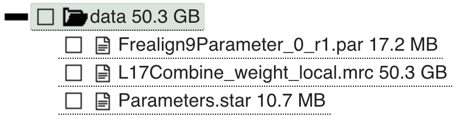
    *Screenshot from the EMPIAR entry*

- The **particle images** are in the file `L17Combine_weight_local.mrc`. There is a typo in the file extension, so rename this file with the `.mrcs` extension.
    - `$ mv L17Combine_weight_local.mrc L17Combine_weight_local.mrcs`
- The **CTF parameters** for each particle are in the metadata file, `Parameters.star`. We will extract the CTF parameters from this file later in [Step 3](step3).
    - `$ head Parameters.star -n 20`

        ```
        data_

        loop_
        _rlnImageName #1
        _rlnMicrographName #2
        _rlnDefocusU #3
        _rlnDefocusV #4
        _rlnDefocusAngle #5
        _rlnVoltage #6
        _rlnSphericalAberration #7
        _rlnAmplitudeContrast #8
        _rlnMagnification #9
        _rlnDetectorPixelSize #10
        1@L17Combine_weight_local.mrcs 1 15301.1 14916.4 5.28  300 2.7 0.07 38168 5
        2@L17Combine_weight_local.mrcs 2 15303.0 14918.4 5.28  300 2.7 0.07 38168 5
        3@L17Combine_weight_local.mrcs 3 15150.7 14766.0 5.28  300 2.7 0.07 38168 5
        4@L17Combine_weight_local.mrcs 4 15181.9 14797.3 5.28  300 2.7 0.07 38168 5
        5@L17Combine_weight_local.mrcs 5 15366.8 14982.2 5.28  300 2.7 0.07 38168 5
        6@L17Combine_weight_local.mrcs 6 15305.0 14920.3 5.28  300 2.7 0.07 38168 5
        7@L17Combine_weight_local.mrcs 7 15177.4 14792.7 5.28  300 2.7 0.07 38168 5
        ```

- Poses (i.e. particle alignments) are **not** present in the deposited data, so we will next run a consensus reconstruction.

---
(step2)=
## 2) Consensus reconstruction (optional)

- Perform a **C1 homogeneous refinement** in your favorite cryo-EM software package. We will be using the poses from this "consensus reconstruction".
- To skip this step, download the poses from [https://github.com/zhonge/cryodrgn_empiar/blob/main/empiar10076/inputs/cryosparc_P4_J33_004_particles.cs](https://github.com/zhonge/cryodrgn_empiar/blob/main/empiar10076/inputs/cryosparc_P4_J33_004_particles.cs)
- A detailed walkthrough of this process is out of the scope of this guide, but we will briefly summarize the steps we used in cryoSPARC v2.4.
    - In cryoSPARC, 1) import the particles, 2) run an *ab initio* reconstruction job, then 3) run a homogeneous refinement job, all with default parameters.
        - For step (1), note that the data-sign of EMPIAR-10076 is flipped from most cryo-EM datasets (i.e. dark-on-light particles), so you will need to toggle the data sign when importing the particles.
    - Final result of refinement:


*Note the partial occupancy of the mature assembly state elements (e.g. the shoulders of the ribosome); Also, note that the handedness of the reconstructed density map is flipped (50% chance from *ab initio* step). We will flip the output density maps from cryoDRGN later on in this tutorial.*

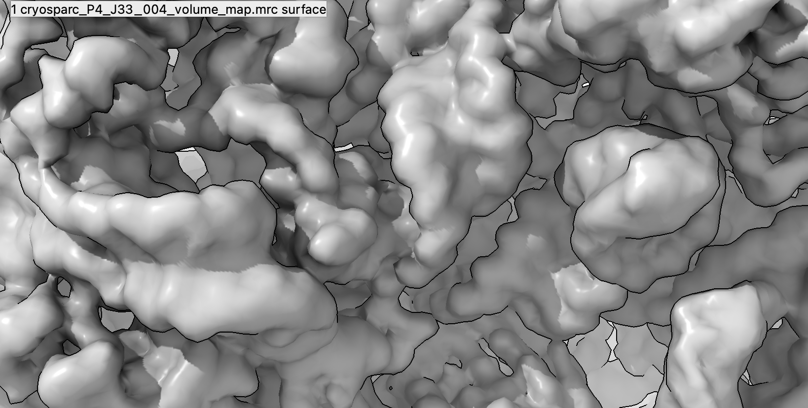
*High resolution features are a good sign that the poses are accurate, even if other regions are less resolved due to heterogeneity.*


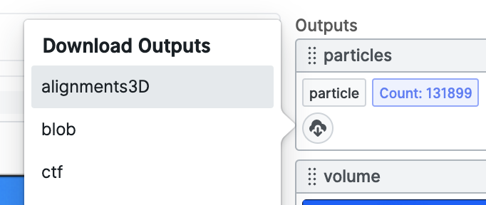
*CryoSPARC's metadata file (a .cs file) that contains particle poses and CTF parameters can be downloaded from the web interface as the "alignments3D" output or found in the job directory in the filesystem where cryoSPARC is running.*

(step3)=
## 3) Preprocess inputs

In this step, we will first extract poses ([Step 3.1](step3-1)), then extract CTF parameters ([Step 3.2](step3-2)), then downsample our images ([Step 3.3](step3-3)).

Pose and CTF parameters are stored in various formats depending on the upstream processing software. CryoDRGN contains scripts to convert this information to a `.pkl` file format.

- What are `.pkl` files?

    A [pickle](https://docs.python.org/3/library/pickle.html) is a python module/format that allows you to serialize most python data objects to disk and re-load without any type conversion or file parsing. You can view any .pkl object using the cryoDRGN API :

    ```python
    from cryodrgn import utils
    z = utils.load_pkl('z.pkl')
    utils.save_pkl(z, 'z.copy.pkl')
    ```

(step3-1)=
### 3.1) Convert poses to cryoDRGN format

- CryoDRGN has two executables for parsing pose information (i.e. particle alignments) from either a cryoSPARC `.cs` file or a RELION `.star` file.
    - `cryodrgn parse_pose_star -h`

        ```
        (cryodrgn) $ cryodrgn parse_pose_star -h
        usage: cryodrgn parse_pose_star [-h] -o PKL [-D D] [--Apix APIX] input

        Parse image poses from RELION .star file

        positional arguments:
          input        RELION .star file

        optional arguments:
          -h, --help   show this help message and exit
          -o PKL       Output pose.pkl

        Optionally provide missing image parameters:
          -D D         Box size of reconstruction (pixels)
          --Apix APIX  Pixel size (A); Required if translations are specified in Angstroms
        ```

        - `-D` should be set to the box size of the refinement
        - Note: the flag  `--relion31` and the argument  `--Apix X.XX` are required if the .star file from RELION version 3.1 or later (e.g. if the .star file contains the `data_optics` group). The pixel size should be the pixel size of the refinement.
    - `cryodrgn parse_pose_csparc -h`

        ```
        (cryodrgn) $ cryodrgn parse_pose_csparc -h
        usage: cryodrgn parse_pose_csparc [-h] [--abinit] [--hetrefine] -D D -o PKL input

        Parse image poses from a cryoSPARC .cs metafile

        positional arguments:
          input        Cryosparc .cs file

        optional arguments:
          -h, --help   show this help message and exit
          --abinit     Flag if results are from ab-initio reconstruction
          --hetrefine  Flag if results are from a heterogeneous refinements (default: homogeneous refinement)
          -D D         Box size of reconstruction (pixels)
          -o PKL       Output pose.pkl
        ```

- For this tutorial, we will use `cryodrgn parse_pose_csparc`  to extract poses from the cryoSPARC refinement output `cryosparc_P4_J33_004_particles.cs` from [Step 2](step2).
    - Example command and output:
        - `$ cryodrgn parse_pose_csparc cryosparc_P4_J33_004_particles.cs -D 320 -o poses.pkl`

            ```
            (cryodrgn) [Wed Feb 03 17:12 het] cryodrgn parse_pose_csparc empiar10076/P4/J33/cryosparc_P4_J33_004_particles.cs -D 320 -o poses.pkl
            0 uid 3300296402854382810
            1 blob/path b'J3/imported/L17Combine_weight_local.mrcs'
            2 blob/idx 0
            3 blob/shape [320 320]
            4 blob/psize_A 1.31
            5 blob/sign 1.0
            6 ctf/type b'imported'
            7 ctf/accel_kv 300.0
            8 ctf/cs_mm 2.7
            9 ctf/amp_contrast 0.07
            10 ctf/df1_A 15301.1
            11 ctf/df2_A 14916.4
            12 ctf/df_angle_rad 0.092153385
            13 ctf/phase_shift_rad 0.0
            14 ctf/scale 1.0
            15 ctf/scale_const 0.0
            16 ctf/cross_corr_ctffind4 0.0
            17 ctf/ctf_fit_to_A 0.0
            18 ctf/fig_of_merit_gctf 0.0
            19 prepare/float_value 0.0
            20 alignments3D/split 1
            21 alignments3D/shift [2.75 7.85]
            22 alignments3D/pose [ 2.1353014 -1.3428906 -0.8660417]
            23 alignments3D/psize_A 1.31
            24 alignments3D/error 25082.113
            25 alignments3D/error_min 25068.746
            26 alignments3D/resid_pow 25082.113
            27 alignments3D/slice_pow 133.63882
            28 alignments3D/image_pow 25300.285
            29 alignments3D/cross_cor 351.81055
            30 alignments3D/alpha 1.3162737
            31 alignments3D/weight 0.0
            32 alignments3D/pose_ess 0.0
            33 alignments3D/shift_ess 0.0
            34 alignments3D/class_posterior 1.0
            35 alignments3D/class 0
            36 alignments3D/class_ess 1.0
            2021-02-03 17:13:12     Extracting rotations from alignments3D/pose
            2021-02-03 17:13:12     Transposing rotation matrix
            2021-02-03 17:13:13     (131899, 3, 3)
            2021-02-03 17:13:13     Extracting translations from alignments3D/shift
            2021-02-03 17:13:13     (131899, 2)
            2021-02-03 17:13:13     Writing /red/zhonge/cryoem/vae3d/00_data/empiar10076/het/poses.pkl
            ```

- Note: `-D` should be set to the box size of the refinement, which was 320 in this case

---
(step3-2)=
### 3.2) Convert CTF parameters to cryoDRGN format

- CryoDRGN has two executables for parsing CTF information from either a cryoSPARC `.cs` file or a RELION `.star` file.
    - `cryodrgn parse_ctf_star -h`

        ```
        (cryodrgn) $ cryodrgn parse_ctf_star -h
        usage: cryodrgn parse_ctf_star [-h] -o O [--png PNG] [-D D] [--Apix APIX] [--kv KV] [--cs CS] [-w W] [--ps PS] star

        Parse CTF parameters from a RELION .star file

        positional arguments:
          star         Input

        optional arguments:
          -h, --help   show this help message and exit
          -o O         Output pkl of CTF parameters
          --png PNG    Optionally plot the CTF

        Optionally provide missing image parameters:
          -D D         Image size in pixels
          --Apix APIX  Angstroms per pixel
          --kv KV      Accelerating voltage (kV)
          --cs CS      Spherical abberation (mm)
          -w W         Amplitude contrast ratio
          --ps PS      Phase shift (deg)
        ```

    - `cryodrgn parse_ctf_csparc -h`

        ```
        (cryodrgn) $ cryodrgn parse_ctf_csparc -h
        usage: cryodrgn parse_ctf_csparc [-h] -o O [--png PNG] [-D D] [--Apix APIX] cs

        Parse CTF parameters from a cryoSPARC particles.cs file

        positional arguments:
          cs           Input cryosparc particles.cs file

        optional arguments:
          -h, --help   show this help message and exit
          -o O         Output pkl of CTF parameters
          --png PNG    Optionally plot the CTF

        Optionally provide missing image parameters:
          -D D         Image size in pixels
          --Apix APIX  Angstroms per pixel
        ```

- We can extract the CTF parameters from the deposited Parameters.star file:
    - Example command:

        `$ cryodrgn parse_ctf_star Parameters.star --Apix 1.31 -D 320 -o ctf.pkl --ps 0`

        - Example output

            ```
            (cryodrgn) [Wed Feb 03 17:02 empiar10076] cryodrgn parse_ctf_star Parameters.star --Apix 1.31 -D 320 -o ctf.pkl --ps 0
            2021-02-03 17:02:33     131899 particles
            2021-02-03 17:02:33     Overriding phase shift with 0.0
            2021-02-03 17:02:33     CTF parameters for first particle:
            2021-02-03 17:02:33     Image size (pix)  : 320
            2021-02-03 17:02:33     A/pix             : 1.31
            2021-02-03 17:02:33     DefocusU (A)      : 15301.1
            2021-02-03 17:02:33     DefocusV (A)      : 14916.4
            2021-02-03 17:02:33     Dfang (deg)       : 5.28
            2021-02-03 17:02:33     voltage (kV)      : 300.0
            2021-02-03 17:02:33     cs (mm)           : 2.7
            2021-02-03 17:02:33     w                 : 0.07
            2021-02-03 17:02:33     Phase shift (deg) : 0.0
            2021-02-03 17:02:33     Saving /red/sparky/data/cryosparc/l17_davis_cell/raw_stack/ctf.pkl
            ```

        - The pixel size ( `--Apix 1.31`), image size (`-D 320`), and phase shift (`--ps 0`) are provided separately since they are not present in the .star file.
- This metadata is also present in the cryoSPARC refinement .cs file. Below is an example usage of `cryodrgn parse_ctf_csparc` to extract the CTF information from the `cryosparc_P4_J33_004_particles.cs` file:
    - Example command:

        `$ cryodrgn parse_ctf_csparc cryosparc_P4_J33_004_particles.cs -o ctf.pkl`

        - Example output

            ```
            (cryodrgn) [Wed Feb 03 17:13 het] cryodrgn parse_ctf_csparc empiar10076/P4/J33/cryosparc_P4_J33_004_particles.cs -o ctf.pkl
            2021-02-03 17:16:52     131899 particles
            2021-02-03 17:16:52     Image size (pix)  : 320
            2021-02-03 17:16:52     A/pix             : 1.309999942779541
            2021-02-03 17:16:52     DefocusU (A)      : 15301.099609375
            2021-02-03 17:16:52     DefocusV (A)      : 14916.400390625
            2021-02-03 17:16:52     Dfang (deg)       : 5.280000044476548
            2021-02-03 17:16:52     voltage (kV)      : 300.0
            2021-02-03 17:16:52     cs (mm)           : 2.700000047683716
            2021-02-03 17:16:52     w                 : 0.07000000029802322
            2021-02-03 17:16:52     Phase shift (deg) : 0.0
            2021-02-03 17:16:52     Saving /red/zhonge/cryoem/vae3d/00_data/empiar10076/het/ctf.pkl
            ```


---
(step3-3)=
### 3.3) Downsample images

CryoDRGN training time is highly dependent on the image size (See Fig. 2E in Zhong et al.). We will downsample images to an image size of **D=128** (where D is the image dimension in pixels, i.e. a 128x128 image) using `cryodrgn downsample`. Later on, we will train a higher resolution model using larger images (**D=256**).

Because of the tradeoffs between training time and representation capacity of the neural networks, we recommend training on images with a maximum of D=256. In general, to optimize training time, we encourage using the smallest possible image size given the desired/expected resolution of the final density maps and their motions. Here, using an image size of (256x256) corresponds to a pixel size of 1.31*320/256 = 1.6375 A/pix and a Nyquist resolution of 3.275 A, which is still below the resolutions of the published density maps (~4-5 A).

- `cryodrgn downsample -h`

    ```
    (cryodrgn) $ cryodrgn downsample -h
    usage: cryodrgn downsample [-h] -D D -o MRCS [-b B] [--is-vol] [--chunk CHUNK] [--datadir DATADIR] [--max-threads MAX_THREADS] mrcs

    Downsample an image stack or volume by clipping fourier frequencies

    positional arguments:
      mrcs                  Input particles or volume (.mrc, .mrcs, .star, or .txt)

    optional arguments:
      -h, --help            show this help message and exit
      -D D                  New box size in pixels, must be even
      -o MRCS               Output projection stack (.mrcs)
      -b B                  Batch size for processing images (default: 5000)
      --is-vol              Flag if input .mrc is a volume
      --chunk CHUNK         Chunksize (in # of images) to split particle stack when saving
      --datadir DATADIR     Optionally provide path to input .mrcs if loading from a .star or .cs file
      --max-threads MAX_THREADS
                            Maximum number of CPU cores for parallelization (default: 16)
    ```


**Downsample to D=256**

- First downsample our input file `L17Combine_weight_local.mrcs` to an image size of D=256, saved as the output file `particles.256.mrcs`.
    - Example command:

        ```bash
        (cryodrgn) $ cryodrgn downsample L17Combine_weight_local.mrcs -D 256 -o particles.256.mrcs --chunk 50000
        ```

        - Use the `--chunk 50000` flag to chunk the output into separate .mrcs containing 50k images each to avoid out-of-memory errors when saving out a large particle stack. Now, instead of a single output file, downsampled images will be stored in three separate .mrcs files  (`particles.256.0.mrcs`, `particles.256.1.mrcs`, and `particles.256.2.mrcs`), the first two containing 50k images, and the third with the remaining 31,899 images, and a text file, `particles.256.txt` listing the three .mrcs files.
        - Note: Chunked .mrcs files that are listed in a .txt file can contain either absolute paths or relative paths. By default the .txt file will only contain the file names (therefore it must remain in the same directory as the .mrcs).

**Downsample to D=128**

- Next downsample our D=256 particles to D=128. Example command:

    ```bash
    (cryodrgn) $ $ cryodrgn downsample particles.256.txt -D 128 -o particles.128.mrcs
    ```

    - The downsampled image stack will be 8.1GB
    - Note: You can also downsample from the original particles; it is faster (and equivalent) to do so from the smaller D=256 images.

**Additional usage notes**

- `cryodrgn downsample` can also be used to downsample volumes using the `--is-vol` argument.
- The input format to specify the particle stack may also be a `.star` file or a `.cs` file.
    - If the paths to the .mrcs particles given by the .star/.cs file are broken, you can overwrite them using the argument `--datadir [PATH TO DIRECTORY WITH .MRCS]` . In some cases, the `--datadir` path should point to the *project directory* in order to complete relative file paths given in the .star/.cs file.


---

## 4) CryoDRGN training

When the input image stack (.mrcs), image poses (.pkl), and CTF parameters (.pkl) have been prepared, a cryoDRGN model can be trained with the following executable:

- `cryodrgn train_vae -h`

    ```
    (cryodrgn) $ cryodrgn train_vae -h
    usage: cryodrgn train_vae [-h] -o OUTDIR --zdim ZDIM --poses POSES [--ctf pkl] [--load WEIGHTS.PKL] [--checkpoint CHECKPOINT]
                              [--log-interval LOG_INTERVAL] [-v] [--seed SEED] [--ind PKL] [--uninvert-data] [--no-window] [--window-r WINDOW_R]
                              [--datadir DATADIR] [--lazy] [--preprocessed] [--max-threads MAX_THREADS] [--tilt TILT] [--tilt-deg TILT_DEG] [-n NUM_EPOCHS]
                              [-b BATCH_SIZE] [--wd WD] [--lr LR] [--beta BETA] [--beta-control BETA_CONTROL] [--norm NORM NORM] [--amp] [--multigpu]
                              [--do-pose-sgd] [--pretrain PRETRAIN] [--emb-type {s2s2,quat}] [--pose-lr POSE_LR] [--enc-layers QLAYERS] [--enc-dim QDIM]
                              [--encode-mode {conv,resid,mlp,tilt}] [--enc-mask ENC_MASK] [--use-real] [--dec-layers PLAYERS] [--dec-dim PDIM]
                              [--pe-type {geom_ft,geom_full,geom_lowf,geom_nohighf,linear_lowf,gaussian,none}] [--feat-sigma FEAT_SIGMA] [--pe-dim PE_DIM]
                              [--domain {hartley,fourier}] [--activation {relu,leaky_relu}]
                              particles

    Train a VAE for heterogeneous reconstruction with known pose

    positional arguments:
      particles             Input particles (.mrcs, .star, .cs, or .txt)

    optional arguments:
      -h, --help            show this help message and exit
      -o OUTDIR, --outdir OUTDIR
                            Output directory to save model
      --zdim ZDIM           Dimension of latent variable
      --poses POSES         Image poses (.pkl)
      --ctf pkl             CTF parameters (.pkl)
      --load WEIGHTS.PKL    Initialize training from a checkpoint
      --checkpoint CHECKPOINT
                            Checkpointing interval in N_EPOCHS (default: 1)
      --log-interval LOG_INTERVAL
                            Logging interval in N_IMGS (default: 1000)
      -v, --verbose         Increaes verbosity
      --seed SEED           Random seed

    Dataset loading:
      --ind PKL             Filter particle stack by these indices
      --uninvert-data       Do not invert data sign
      --no-window           Turn off real space windowing of dataset
      --window-r WINDOW_R   Windowing radius (default: 0.85)
      --datadir DATADIR     Path prefix to particle stack if loading relative paths from a .star or .cs file
      --lazy                Lazy loading if full dataset is too large to fit in memory (Should copy dataset to SSD)
      --preprocessed        Skip preprocessing steps if input data is from cryodrgn preprocess_mrcs
      --max-threads MAX_THREADS
                            Maximum number of CPU cores for FFT parallelization (default: 16)

    Tilt series:
      --tilt TILT           Particles (.mrcs)
      --tilt-deg TILT_DEG   X-axis tilt offset in degrees (default: 45)

    Training parameters:
      -n NUM_EPOCHS, --num-epochs NUM_EPOCHS
                            Number of training epochs (default: 20)
      -b BATCH_SIZE, --batch-size BATCH_SIZE
                            Minibatch size (default: 8)
      --wd WD               Weight decay in Adam optimizer (default: 0)
      --lr LR               Learning rate in Adam optimizer (default: 0.0001)
      --beta BETA           Choice of beta schedule or a constant for KLD weight (default: 1/zdim)
      --beta-control BETA_CONTROL
                            KL-Controlled VAE gamma. Beta is KL target. (default: None)
      --norm NORM NORM      Data normalization as shift, 1/scale (default: 0, std of dataset)
      --amp                 Accelerate training speed with mixed-precision training
      --multigpu            Parallelize training across all detected GPUs

    Pose SGD:
      --do-pose-sgd         Refine poses with gradient descent
      --pretrain PRETRAIN   Number of epochs with fixed poses before pose SGD (default: 1)
      --emb-type {s2s2,quat}
                            SO(3) embedding type for pose SGD (default: quat)
      --pose-lr POSE_LR     Learning rate for pose optimizer (default: 0.0003)

    Encoder Network:
      --enc-layers QLAYERS  Number of hidden layers (default: 3)
      --enc-dim QDIM        Number of nodes in hidden layers (default: 256)
      --encode-mode {conv,resid,mlp,tilt}
                            Type of encoder network (default: resid)
      --enc-mask ENC_MASK   Circular mask of image for encoder (default: D/2; -1 for no mask)
      --use-real            Use real space image for encoder (for convolutional encoder)

    Decoder Network:
      --dec-layers PLAYERS  Number of hidden layers (default: 3)
      --dec-dim PDIM        Number of nodes in hidden layers (default: 256)
      --pe-type {geom_ft,geom_full,geom_lowf,geom_nohighf,linear_lowf,gaussian,none}
                            Type of positional encoding (default: geom_lowf)
      --feat-sigma FEAT_SIGMA
                            Scale for random Gaussian features
      --pe-dim PE_DIM       Num features in positional encoding (default: image D)
      --domain {hartley,fourier}
                            Decoder representation domain (default: fourier)
      --activation {relu,leaky_relu}
                            Activation (default: relu)
    ```


Many of the parameters of this script have sensible defaults. The required arguments are:

- an input image stack (`.mrcs` or other listed file types)
- `--poses`, image poses (`.pkl`) that correspond to the input images (see [Step 3.1](step3-1))
- `--ctf`, ctf parameters (`.pkl`), unless phase-flipped images are used (see [Step 3.2](step3-2))
- `--zdim`, the dimension of the latent variable
- `-o`, a clean output directory for storing results

Additional parameters which are typically set include:

- `-n`, Number of epochs to train
- `--uninvert-data`, A flag to invert the image sign if particles are dark on light (i.e. negative stain format)
- Neural network architecture settings with `--enc-layers`, `--enc-dim`, `--dec-layers`, `--dec-dim`
- `--multigpu` to enable parallelized training across multiple GPUs (fast!)

### General recommended workflow**

1. First, train on lower resolution images (e.g. D=128) using the default architecture (fast) as an initial pass to sanity check results and remove junk particles. **(D=128, default 256x3 architecture)**
2. After any particle filtering, then train a larger model with the `--enc-dim 1024` and `--dec-dim 1024` arguments, which in theory can learn more heterogeneity. **(D=128, large 1024x3 architecture)**
3. Finally, after validation, pose optimization, and any necessary particle filtering, then train on the full resolution image stack (up to D=256) with a large architecture. **(D=256, large 1024x3 architecture)**

In this tutorial we will walk through the commands and analysis for Step 1 and Step 3 in the above workflow. You can run step 2 on your own to see how the results compare.

#### CryoDRGN initial training

- Run `cryodrgn train_vae` on the full particle stack of D=128 particles (1 GPU; 64GB memory requirement)

    Example command:

    ```bash
    $ cryodrgn train_vae data/128/particles.128.mrcs \
        --ctf data/ctf.pkl \
    	--poses data/poses.pkl \
    	--zdim 8 \
    	-n 50 \
    	--uninvert-data \ # NOTE: Use this flag only if particles are dark-on-light (negative stain format)
    	-o tutorial/00_vae128 > tutorial_00.log
    ```

    Inputs:

    - particles (.mrcs, .star, .txt, or .cs) format, here `data/128/particles.128.mrcs`
    - `--ctf` ctf parameters in a cryodrgn .pkl file, here `data/ctf.pkl`
    - `--poses` poses in a cryodrgn .pkl file, here `data/poses.pkl`

    Arguments:

    - `--zdim 8` to specify the dimension of the latent variable (i.e. each particle will get assigned an 8-dimensional vector as its *latent embedding*)
    - `-n 50` to specify 50 epochs of training (i.e. 50 iterations through the dataset)
    - `-o tutorial/00`, a clean output directory (will get created if it does not already exist)
    - Use the `--uninvert-data` flag to flip the data sign of the particles dataset (This flag is not needed for the majority of cryo-EM datasets)

    Outputs:

    - Log

        ```
        2021-02-03 17:46:01     /nobackup/users/zhonge/anaconda3/envs/cryodrgn4/bin/cryodrgn train_vae data/128/projections.128.mrcs --ctf data/ctf.new.pkl --poses data/pose.pkl --zdim 8 -n 50 -o tutorial/00
        2021-02-03 17:46:01     Namespace(activation='relu', amp=False, batch_size=8, beta=None, beta_control=None, checkpoint=1, ctf='/nobackup/users/zhonge/cryodrgn/11_l17_ribo/data/ctf.new.pkl', datadir=None, do_pose_sgd=False, domain='fourier', emb_type='quat', enc_mask=None, encode_mode='resid', func=<function main at 0x2000ab052840>, ind=None, invert_data=True, lazy=False, load=None, log_interval=1000, lr=0.0001, multigpu=False, norm=None, num_epochs=50, outdir='/nobackup/users/zhonge/cryodrgn/11_l17_ribo/tutorial/00', particles='/nobackup/users/zhonge/cryodrgn/11_l17_ribo/data/128/projections.128.mrcs', pdim=256, pe_dim=None, pe_type='geom_lowf', players=3, pose_lr=0.0003, poses='/nobackup/users/zhonge/cryodrgn/11_l17_ribo/data/pose.pkl', pretrain=1, qdim=256, qlayers=3, relion31=False, seed=43266, tilt=None, tilt_deg=45, use_real=False, verbose=False, wd=0, window=True, zdim=8)
        2021-02-03 17:46:01     Use cuda True
        2021-02-03 17:46:09     Loaded 131899 128x128 images
        2021-02-03 17:47:54     Normalized HT by 0 +/- 278.593719482421
        2021-02-03 17:48:04     Loading ctf params from /nobackup/users/zhonge/cryodrgn/11_l17_ribo/data/ctf.new.pkl
        2021-02-03 17:48:04     Image size (pix)  : 128
        2021-02-03 17:48:04     A/pix             : 3.2750000953674316
        2021-02-03 17:48:04     DefocusU (A)      : 15301.099609375
        2021-02-03 17:48:04     DefocusV (A)      : 14916.400390625
        2021-02-03 17:48:04     Dfang (deg)       : 5.28000020980835
        2021-02-03 17:48:04     voltage (kV)      : 300.0
        2021-02-03 17:48:04     cs (mm)           : 2.700000047683716
        2021-02-03 17:48:04     w                 : 0.07000000029802322
        2021-02-03 17:48:04     Phase shift (deg) : 0.0
        2021-02-03 17:48:04     Using circular lattice with radius 64
        2021-02-03 17:48:05     HetOnlyVAE(
          (encoder): ResidLinearMLP(
            (main): Sequential(
              (0): Linear(in_features=12852, out_features=256, bias=True)
              (1): ReLU()
              (2): ResidLinear(
                (linear): Linear(in_features=256, out_features=256, bias=True)
              )
              (3): ReLU()
              (4): ResidLinear(
                (linear): Linear(in_features=256, out_features=256, bias=True)
              )
              (5): ReLU()
              (6): ResidLinear(
                (linear): Linear(in_features=256, out_features=256, bias=True)
              )
              (7): ReLU()
              (8): Linear(in_features=256, out_features=16, bias=True)
            )
          )
          (decoder): FTPositionalDecoder(
            (decoder): ResidLinearMLP(
              (main): Sequential(
                (0): Linear(in_features=392, out_features=256, bias=True)
                (1): ReLU()
                (2): ResidLinear(
                  (linear): Linear(in_features=256, out_features=256, bias=True)
                )
                (3): ReLU()
                (4): ResidLinear(
                  (linear): Linear(in_features=256, out_features=256, bias=True)
                )
                (5): ReLU()
                (6): ResidLinear(
                  (linear): Linear(in_features=256, out_features=256, bias=True)
                )
                (7): ReLU()
                (8): Linear(in_features=256, out_features=2, bias=True)
              )
            )
          )
        )
        2021-02-03 17:48:05     3790354 parameters in model
        2021-02-03 17:48:11     # [Train Epoch: 1/50] [1000/131899 images] gen loss=1.044404, kld=2.817325, beta=0.125000, loss=1.044431
        2021-02-03 17:48:14     # [Train Epoch: 1/50] [2000/131899 images] gen loss=1.039896, kld=7.318097, beta=0.125000, loss=1.039967
        2021-02-03 17:48:17     # [Train Epoch: 1/50] [3000/131899 images] gen loss=1.010868, kld=8.658796, beta=0.125000, loss=1.010953

        .
        .
        .

        2021-02-04 00:39:24     # [Train Epoch: 50/50] [126000/131899 images] gen loss=0.989016, kld=26.381516, beta=0.125000, loss=0.989272
        2021-02-04 00:39:28     # [Train Epoch: 50/50] [127000/131899 images] gen loss=0.948055, kld=24.869091, beta=0.125000, loss=0.948297
        2021-02-04 00:39:31     # [Train Epoch: 50/50] [128000/131899 images] gen loss=1.017258, kld=25.462738, beta=0.125000, loss=1.017505
        2021-02-04 00:39:35     # [Train Epoch: 50/50] [129000/131899 images] gen loss=1.033358, kld=30.238625, beta=0.125000, loss=1.033653
        2021-02-04 00:39:38     # [Train Epoch: 50/50] [130000/131899 images] gen loss=0.966860, kld=24.983553, beta=0.125000, loss=0.967103
        2021-02-04 00:39:41     # [Train Epoch: 50/50] [131000/131899 images] gen loss=0.982898, kld=25.034485, beta=0.125000, loss=0.983141
        2021-02-04 00:39:44     # =====> Epoch: 50 Average gen loss = 0.998177, KLD = 26.589939, total loss = 0.998435; Finished in 0:07:27.660706
        2021-02-04 00:41:18     Finsihed in 6:55:17.244481 (0:08:18.344890 per epoch)
        ```


    The training will take ~7.5 min/epoch on a V100 GPU, requiring ~7 hours total. The output directory will contain the following files:

    - `config.yaml` a configuration file containing all inputs and settings for the job
    - `weights.pkl` the final neural network weights (and intermediate checkpoints `weights.n.pkl`)
    - `z.pkl` the final per-particle latent embeddings (and embeddings from intermediate epochs `z.n.pkl`)

     Note you can use `cryodrgn analyze` to analyze intermediate epochs during training.


#### Extending or restarting from a checkpoint

If the run was interrupted before it reached the desired number of epochs or you would like to train longer, a training job can be extended with the `--load` argument. For example, to resume training that was interrupted at epoch 24:

```bash
# Use the same command with extra --load argument
$ cryodrgn train_vae data/128/particles.128.mrcs \
    --ctf data/ctf.pkl \
    --poses data/poses.pkl \
    --zdim 8 \
    -n 50 \
    --uninvert-data \ # NOTE: Use this flag only if particles are dark-on-light (negative stain format)
    --load tutorial/00_vae128/weights.24.pkl \ # 0-based indexing
    -o tutorial/00_vae128 >> tutorial.00.log
```

You can also use `--load latest`, and cryodrgn will try to detect the latest set of model weights in the specified workdir.

## 5) cryoDRGN analysis

Once the model has finished training, use the `cryodrgn analyze` command to visualize the latent space, generate density maps, and generate template Jupyter notebooks for further interactive filtering, visualization, and analysis.

- `$ cryodrgn analyze -h`

    ```
    (cryodrgn) $ cryodrgn analyze -h
    usage: cryodrgn analyze [-h] [--device DEVICE] [-o OUTDIR] [--skip-vol]
                            [--skip-umap] [--Apix APIX] [--flip] [-d DOWNSAMPLE]
                            [--pc PC] [--ksample KSAMPLE]
                            workdir epoch

    Visualize latent space and generate volumes

    positional arguments:
      workdir               Directory with cryoDRGN results
      epoch                 Epoch number N to analyze (0-based indexing,
                            corresponding to z.N.pkl, weights.N.pkl)

    optional arguments:
      -h, --help            show this help message and exit
      --device DEVICE       Optionally specify CUDA device
      -o OUTDIR, --outdir OUTDIR
                            Output directory for analysis results (default:
                            [workdir]/analyze.[epoch])
      --skip-vol            Skip generation of volumes
      --skip-umap           Skip running UMAP

    Extra arguments for volume generation:
      --Apix APIX           Pixel size to add to .mrc header (default: 1 A/pix)
      --flip                Flip handedness of output volume
      -d DOWNSAMPLE, --downsample DOWNSAMPLE
                            Downsample volumes to this box size (pixels)
      --pc PC               Number of principal component traversals to generate
                            (default: 2)
      --ksample KSAMPLE     Number of kmeans samples to generate (default: 20)
      --vol-start-index VOL_START_INDEX
                            Default value of start index for volume generation (default: 0)
    ```


This script runs a series of standard analyses that will be further described below:

- PCA and UMAP visualizations of the particle latent embeddings
- Generation of volumes from the latent embeddings at kmeans cluster centers
- Generation of trajectories along the first and second principal components of the latent embeddings
- Generation of a template jupyter notebook that may be used for further interactive analyses, visualization, and volume generation
- (New in v0.3.2) Generation of a template jupyter notebook that may be used for particle filtering
- (New in v2.2.0) Generation of a template jupyter notebook for adjusting any of the output figures

Example command to run cryodrgn analyze on the directory `tutorial/00_vae128` and the trained weights from epoch 49 (0-based indexing) (1 GPU; ~5 min)

```bash
# Usage: cryodrgn analyze [workdir] [epoch]
$ cryodrgn analyze tutorial/00_vae128 49 --flip --Apix 3.275
```

- Example output log

    ```
    (cryodrgn4) [Thu Feb 04 02:57 00] cryodrgn analyze . 49
    2021-02-04 02:57:18     Saving results to /nobackup/users/zhonge/cryodrgn/11_l17_ribo/tutorial/00/analyze.49
    2021-02-04 02:57:18     Perfoming principal component analysis...
    2021-02-04 02:57:18     Explained variance ratio:
    2021-02-04 02:57:18     [0.22400902 0.2087886  0.16459696 0.10960732 0.09572161 0.07636773
     0.06840914 0.05249962]
    2021-02-04 02:57:18     Generating volumes...
    2021-02-04 02:57:18     Running command:
    cryodrgn eval_vol /nobackup/users/zhonge/cryodrgn/11_l17_ribo/tutorial/00/weights.49.pkl --config /nobackup/users/zhonge/cryodrgn/11_l17_ribo/tutorial/00/config.yaml --zfile /nobackup/users/zhonge/cryodrgn/11_l17_ribo/tutorial/00/analyze.49/pc1/z_values.txt -o /nobackup/users/zhonge/cryodrgn/11_l17_ribo/tutorial/00/analyze.49/pc1 --Apix 1
    2021-02-04 02:57:20     Use cuda True
    2021-02-04 02:57:20     Namespace(Apix=1.0, D=None, activation='relu', config='/nobackup/users/zhonge/cryodrgn/11_l17_ribo/tutorial/00/config.yaml', domain=None, downsample=None, enc_mask=None, encode_mode=None, flip=False, func=<function main at 0x7ffed8e3fe18>, l_extent=None, n=10, norm=None, o='/nobackup/users/zhonge/cryodrgn/11_l17_ribo/tutorial/00/analyze.49/pc1', pdim=None, pe_dim=None, pe_type=None, players=None, prefix='vol_', qdim=None, qlayers=None, verbose=False, weights='/nobackup/users/zhonge/cryodrgn/11_l17_ribo/tutorial/00/weights.49.pkl', z=None, z_end=None, z_start=None, zdim=None, zfile='/nobackup/users/zhonge/cryodrgn/11_l17_ribo/tutorial/00/analyze.49/pc1/z_values.txt')
    2021-02-04 02:57:20     Loaded configuration:
    {'dataset_args': {'ctf': '/nobackup/users/zhonge/cryodrgn/11_l17_ribo/data/ctf.new.pkl',
                      'datadir': None,
                      'do_pose_sgd': False,
                      'ind': None,
                      'invert_data': True,
                      'keepreal': False,
                      'norm': [0, 278.59372],
                      'particles': '/nobackup/users/zhonge/cryodrgn/11_l17_ribo/data/128/projections.128.mrcs',
                      'poses': '/nobackup/users/zhonge/cryodrgn/11_l17_ribo/data/pose.pkl',
                      'window': True},
     'lattice_args': {'D': 129, 'extent': 0.5, 'ignore_DC': True},
     'model_args': {'activation': 'relu',
                    'domain': 'fourier',
                    'enc_mask': 64,
                    'encode_mode': 'resid',
                    'pdim': 256,
                    'pe_dim': None,
                    'pe_type': 'geom_lowf',
                    'players': 3,
                    'qdim': 256,
                    'qlayers': 3,
                    'zdim': 8},
     'seed': 43266}
    2021-02-04 02:57:29     Using circular lattice with radius 64
    2021-02-04 02:57:30     Generating 10 volumes
    2021-02-04 02:57:30     [-0.46911267 -0.69718513 -0.0095188  -2.78874987  0.1540933   0.16372231
      0.31355665  2.17943362]
    2021-02-04 02:57:32     [-0.39820911 -0.56545639 -0.01828557 -2.24070284  0.12997294  0.12582034
      0.25060696  1.75664491]
    2021-02-04 02:57:33     [-0.32730555 -0.43372764 -0.02705235 -1.69265581  0.10585258  0.08791838
      0.18765726  1.33385621]
    2021-02-04 02:57:34     [-0.25640199 -0.3019989  -0.03581912 -1.14460877  0.08173222  0.05001641
      0.12470757  0.91106751]
    2021-02-04 02:57:35     [-0.18549843 -0.17027016 -0.0445859  -0.59656174  0.05761186  0.01211444
      0.06175788  0.48827881]
    2021-02-04 02:57:36     [-0.11459487 -0.03854141 -0.05335267 -0.04851471  0.0334915  -0.02578752
     -0.00119181  0.06549011]
    2021-02-04 02:57:36     [-0.04369131  0.09318733 -0.06211945  0.49953232  0.00937114 -0.06368949
     -0.0641415  -0.35729859]
    2021-02-04 02:57:37     [ 0.02721225  0.22491608 -0.07088622  1.04757935 -0.01474922 -0.10159146
     -0.12709119 -0.78008729]
    2021-02-04 02:57:38     [ 0.09811581  0.35664482 -0.079653    1.59562638 -0.03886958 -0.13949343
     -0.19004089 -1.20287599]
    2021-02-04 02:57:39     [ 0.16901937  0.48837357 -0.08841977  2.14367342 -0.06298993 -0.17739539
     -0.25299058 -1.62566469]
    2021-02-04 02:57:40     Finsihed in 0:00:19.785367
    2021-02-04 02:57:40     Running command:
    cryodrgn eval_vol /nobackup/users/zhonge/cryodrgn/11_l17_ribo/tutorial/00/weights.49.pkl --config /nobackup/users/zhonge/cryodrgn/11_l17_ribo/tutorial/00/config.yaml --zfile /nobackup/users/zhonge/cryodrgn/11_l17_ribo/tutorial/00/analyze.49/pc2/z_values.txt -o /nobackup/users/zhonge/cryodrgn/11_l17_ribo/tutorial/00/analyze.49/pc2 --Apix 1
    2021-02-04 02:57:42     Use cuda True
    2021-02-04 02:57:42     Namespace(Apix=1.0, D=None, activation='relu', config='/nobackup/users/zhonge/cryodrgn/11_l17_ribo/tutorial/00/config.yaml', domain=None, downsample=None, enc_mask=None, encode_mode=None, flip=False, func=<function main at 0x7ffea04efe18>, l_extent=None, n=10, norm=None, o='/nobackup/users/zhonge/cryodrgn/11_l17_ribo/tutorial/00/analyze.49/pc2', pdim=None, pe_dim=None, pe_type=None, players=None, prefix='vol_', qdim=None, qlayers=None, verbose=False, weights='/nobackup/users/zhonge/cryodrgn/11_l17_ribo/tutorial/00/weights.49.pkl', z=None, z_end=None, z_start=None, zdim=None, zfile='/nobackup/users/zhonge/cryodrgn/11_l17_ribo/tutorial/00/analyze.49/pc2/z_values.txt')
    2021-02-04 02:57:42     Loaded configuration:
    {'dataset_args': {'ctf': '/nobackup/users/zhonge/cryodrgn/11_l17_ribo/data/ctf.new.pkl',
                      'datadir': None,
                      'do_pose_sgd': False,
                      'ind': None,
                      'invert_data': True,
                      'keepreal': False,
                      'norm': [0, 278.59372],
                      'particles': '/nobackup/users/zhonge/cryodrgn/11_l17_ribo/data/128/projections.128.mrcs',
                      'poses': '/nobackup/users/zhonge/cryodrgn/11_l17_ribo/data/pose.pkl',
                      'window': True},
     'lattice_args': {'D': 129, 'extent': 0.5, 'ignore_DC': True},
     'model_args': {'activation': 'relu',
                    'domain': 'fourier',
                    'enc_mask': 64,
                    'encode_mode': 'resid',
                    'pdim': 256,
                    'pe_dim': None,
                    'pe_type': 'geom_lowf',
                    'players': 3,
                    'qdim': 256,
                    'qlayers': 3,
                    'zdim': 8},
     'seed': 43266}
    2021-02-04 02:57:44     Using circular lattice with radius 64
    2021-02-04 02:57:44     Generating 10 volumes
    2021-02-04 02:57:44     [ 1.294627   -0.24291033 -1.22768164  0.23142111 -0.33955064  0.78482312
     -2.50019564  1.20387314]
    2021-02-04 02:57:45     [ 0.99771195 -0.20620808 -0.98250969  0.14853748 -0.26071324  0.61755447
     -1.97648029  0.98551235]
    2021-02-04 02:57:46     [ 0.70079691 -0.16950582 -0.73733774  0.06565385 -0.18187584  0.45028583
     -1.45276495  0.76715156]
    2021-02-04 02:57:47     [ 0.40388187 -0.13280357 -0.49216579 -0.01722978 -0.10303843  0.28301718
     -0.9290496   0.54879077]
    2021-02-04 02:57:48     [ 0.10696682 -0.09610131 -0.24699384 -0.1001134  -0.02420103  0.11574853
     -0.40533425  0.33042997]
    2021-02-04 02:57:48     [-0.18994822 -0.05939906 -0.00182189 -0.18299703  0.05463638 -0.05152012
      0.1183811   0.11206918]
    2021-02-04 02:57:49     [-0.48686326 -0.02269681  0.24335006 -0.26588066  0.13347378 -0.21878876
      0.64209644 -0.10629161]
    2021-02-04 02:57:50     [-0.78377831  0.01400545  0.48852201 -0.34876429  0.21231118 -0.38605741
      1.16581179 -0.3246524 ]
    2021-02-04 02:57:51     [-1.08069335  0.0507077   0.73369396 -0.43164792  0.29114859 -0.55332606
      1.68952714 -0.54301319]
    2021-02-04 02:57:52     [-1.37760839  0.08740996  0.97886591 -0.51453155  0.36998599 -0.7205947
      2.21324248 -0.76137398]
    2021-02-04 02:57:53     Finsihed in 0:00:10.702840
    2021-02-04 02:57:53     K-means clustering...
    2021-02-04 02:58:00     Generating volumes...
    2021-02-04 02:58:00     Running command:
    cryodrgn eval_vol /nobackup/users/zhonge/cryodrgn/11_l17_ribo/tutorial/00/weights.49.pkl --config /nobackup/users/zhonge/cryodrgn/11_l17_ribo/tutorial/00/config.yaml --zfile /nobackup/users/zhonge/cryodrgn/11_l17_ribo/tutorial/00/analyze.49/kmeans20/z_values.txt -o /nobackup/users/zhonge/cryodrgn/11_l17_ribo/tutorial/00/analyze.49/kmeans20 --Apix 1
    2021-02-04 02:58:02     Use cuda True
    2021-02-04 02:58:02     Namespace(Apix=1.0, D=None, activation='relu', config='/nobackup/users/zhonge/cryodrgn/11_l17_ribo/tutorial/00/config.yaml', domain=None, downsample=None, enc_mask=None, encode_mode=None, flip=False, func=<function main at 0x7ffeb2fded90>, l_extent=None, n=10, norm=None, o='/nobackup/users/zhonge/cryodrgn/11_l17_ribo/tutorial/00/analyze.49/kmeans20', pdim=None, pe_dim=None, pe_type=None, players=None, prefix='vol_', qdim=None, qlayers=None, verbose=False, weights='/nobackup/users/zhonge/cryodrgn/11_l17_ribo/tutorial/00/weights.49.pkl', z=None, z_end=None, z_start=None, zdim=None, zfile='/nobackup/users/zhonge/cryodrgn/11_l17_ribo/tutorial/00/analyze.49/kmeans20/z_values.txt')
    2021-02-04 02:58:02     Loaded configuration:
    {'dataset_args': {'ctf': '/nobackup/users/zhonge/cryodrgn/11_l17_ribo/data/ctf.new.pkl',
                      'datadir': None,
                      'do_pose_sgd': False,
                      'ind': None,
                      'invert_data': True,
                      'keepreal': False,
                      'norm': [0, 278.59372],
                      'particles': '/nobackup/users/zhonge/cryodrgn/11_l17_ribo/data/128/projections.128.mrcs',
                      'poses': '/nobackup/users/zhonge/cryodrgn/11_l17_ribo/data/pose.pkl',
                      'window': True},
     'lattice_args': {'D': 129, 'extent': 0.5, 'ignore_DC': True},
     'model_args': {'activation': 'relu',
                    'domain': 'fourier',
                    'enc_mask': 64,
                    'encode_mode': 'resid',
                    'pdim': 256,
                    'pe_dim': None,
                    'pe_type': 'geom_lowf',
                    'players': 3,
                    'qdim': 256,
                    'qlayers': 3,
                    'zdim': 8},
     'seed': 43266}
    2021-02-04 02:58:04     Using circular lattice with radius 64
    2021-02-04 02:58:04     Generating 20 volumes
    2021-02-04 02:58:04     [  2.47612858   1.90699387  -6.04850197   5.43400908   0.27650252
     -24.12995529  -2.3250308    3.7706964 ]
    2021-02-04 02:58:05     [-0.38294414  0.05903612 -0.07340568 -2.14857912 -1.43606532 -6.48859549
     -1.28178108  0.9746204 ]
    2021-02-04 02:58:05     [ 0.75751173 -1.02667093  1.90755236 -3.46744156 -0.51795393 -0.53410876
     -0.6747672  -0.07184201]
    2021-02-04 02:58:06     [-0.39390403 -4.45507717  1.54359567 -3.08658767 -0.37659553  0.12258258
     -0.59937257 -0.22234169]
    2021-02-04 02:58:07     [ 1.00644302 -0.63465279 -1.0577668   1.89774811 -0.28295705  0.83203548
     -2.69281244  0.79193765]
    2021-02-04 02:58:08     [ 1.25866413  0.96147162 -1.38003922 -0.0860692  -0.73352259  0.40986091
     -2.08615518  0.60404295]
    2021-02-04 02:58:09     [ 1.66666162 -0.26700783 -0.10245889 -0.29272029  0.68260807  0.62163264
     -0.88520497  0.98171395]
    2021-02-04 02:58:09     [-0.57202214  0.37561724  0.12516868  1.5115962  -0.3613039  -0.3017866
     -0.60656387 -1.45335865]
    2021-02-04 02:58:10     [ 0.74015254  0.34087622  0.30410638  0.71546018 -0.03811092 -0.17879301
      0.25628883 -1.22579646]
    2021-02-04 02:58:11     [ 0.44719604 -0.2432248  -0.52932549 -0.70396465  0.50919217  0.10998529
      2.3488977   0.93258661]
    2021-02-04 02:58:12     [-1.04071832  0.60200369  0.23502171  0.22022174  0.9593488  -0.15067071
      2.34484267 -1.02382338]
    2021-02-04 02:58:12     [-0.94867486 -0.89667982  0.93049031  0.47582638  0.52237713 -0.64064002
      2.15901017 -0.40877968]
    2021-02-04 02:58:13     [ 1.14693427  0.93310452 -0.19505537 -2.90435362 -1.93226695  0.3056525
      0.80431372  1.23579288]
    2021-02-04 02:58:14     [-2.20564294  0.6484825  -1.06616759 -2.64037299 -2.2968111  -0.86852956
      1.28031063  0.94097143]
    2021-02-04 02:58:15     [-1.80046439  2.30461287  1.092592   -2.74578357 -1.52575612 -0.99183404
     -0.01311122 -0.26105565]
    2021-02-04 02:58:15     [-1.050125   -0.81217915  0.75083983 -1.61578703 -0.43990365  0.25753841
      0.10831033  3.08369875]
    2021-02-04 02:58:16     [ 0.02014027 -1.22502518 -0.98093748 -0.37346572  1.85765135  1.13682508
      0.9183864   2.5960722 ]
    2021-02-04 02:58:17     [-0.11215129  0.1362886   0.1612342  -3.04565883  1.92077279  0.20085585
     -1.72337461  1.19097638]
    2021-02-04 02:58:18     [-2.51964045 -0.48837739  0.40034276 -2.05232668 -1.27610278 -0.68975723
     -2.2069602   0.2000891 ]
    2021-02-04 02:58:18     [-3.26598477 -0.72640318  0.30290347 -2.19951153  0.87410563 -0.05870867
     -0.48441201  0.65784246]
    2021-02-04 02:58:19     Finsihed in 0:00:17.491466
    2021-02-04 02:58:20     Running UMAP...
    2021-02-04 03:02:20     Generating plots...
    2021-02-04 03:02:38     Creating jupyter notebook...
    2021-02-04 03:02:38     /nobackup/users/zhonge/cryodrgn/11_l17_ribo/tutorial/00/analyze.49/cryoDRGN_viz.ipynb
    2021-02-04 03:02:38     Creating jupyter notebook...
    2021-02-04 03:02:38     /nobackup/users/zhonge/cryodrgn/11_l17_ribo/tutorial/00/analyze.49/cryoDRGN_filtering.ipynb
    2021-02-04 03:02:38     Finished in 0:05:19.831017
    ```


### **What's in the analysis directory?**

Once `cryodrgn analyze` finishes, there will be a new directory, `analyze.49`, within the job directory:

```bash
(cryodrgn4) $ ls tutorial/00_vae128/analyze.49 # path to analysis directory
cryoDRGN_filtering.ipynb  kmeans20  pc2              umap.pkl  z_pca_hexbin.png
cryoDRGN_viz.ipynb        pc1       umap_hexbin.png  umap.png  z_pca.png
```

### Visualization of the latent space

Because we trained a 8-dimensional latent variable model (`--zdim 8`), each particle image is associated with an 8-D vector embedding (saved in `z.49.pkl` ). `cryodrgn analyze` runs PCA (a linear dimensionality reduction technique) and UMAP (a nonlinear dimensionality technique) to visualize these latent embeddings. These images will be found in the `analyze.49` directory:

PCA

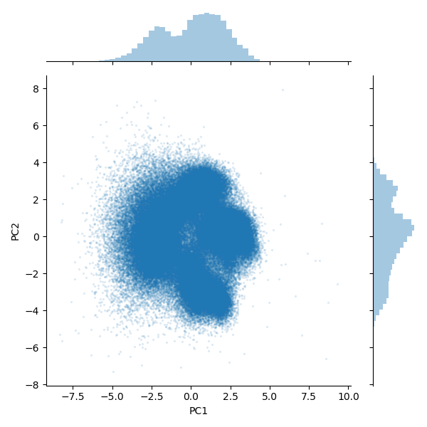

z_pca.png

UMAP


z_pca_hexbin.png

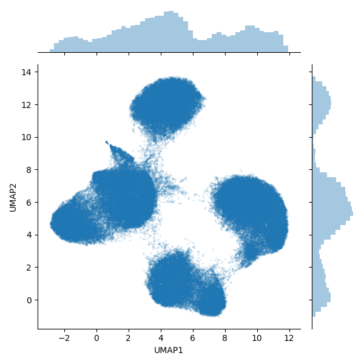

umap.png

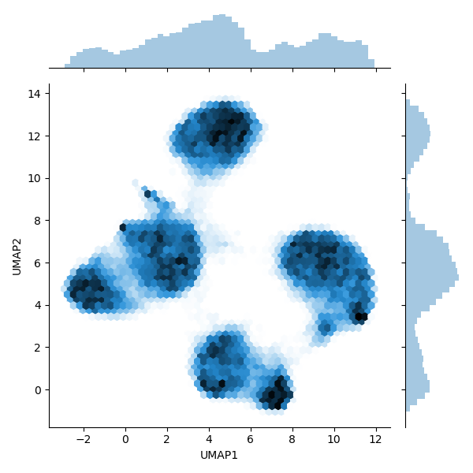

umap_hexbin.png

We can see there are 5 major clusters in the latent space similar to Figure 5A in Zhong et al. We will show how these align with the 4 major classes of the LSU ribosome + a fifth junk class, and how to remove the fifth junk class from the particle stack.

### Sampled density maps

The `analyze.49` directory will also contain a subdirectory kmeans20 with representative reconstructed density maps:

```bash
# contents of the directory
(cryodrgn) $ ls tutorial/00_vae128/analyze.49/kmeans20/
centers_ind.txt  umap.png     vol_003.mrc  vol_007.mrc  vol_011.mrc  vol_015.mrc  vol_019.mrc
centers.txt      vol_000.mrc  vol_004.mrc  vol_008.mrc  vol_012.mrc  vol_016.mrc  z_pca_hex.png
labels.pkl       vol_001.mrc  vol_005.mrc  vol_009.mrc  vol_013.mrc  vol_017.mrc  z_pca.png
umap_hex.png     vol_002.mrc  vol_006.mrc  vol_010.mrc  vol_014.mrc  vol_018.mrc  z_values.txt
```

`cryodrgn analyze` uses the *k*-means clustering algorithm to *partition* the latent space into  k regions (by default k=20), and generate a density map from the center of each of these clusters. The goal is to provide an initial set of summary density maps to visually inspect, not to assign clusters.

**Note:** The number of volumes can be modified with the argument `--ksample 50`.

<iframe src="https://widgets.figshare.com/articles/21171049/embed?show_title=1" width="568" height="351" allowfullscreen frameborder="0"></iframe>

The directory will also contain PCA and UMAP visualizations with annotations of where the 20 density maps were generated from.


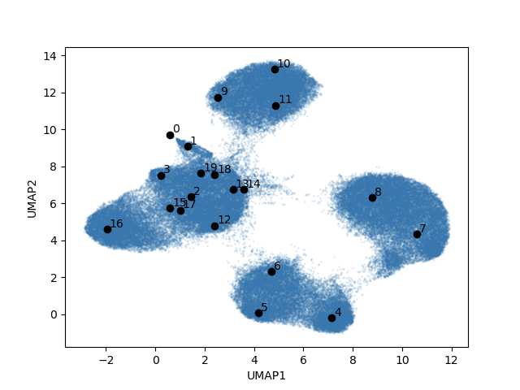


### PC trajectories

There are two subdirectories in the analysis directory that will contain volumes generated along the first and second principal components (PC) of the latent space. By default, the volumes are generated at equally spaced points between the first and 99th percentile of the data distribution projected onto each principal component (e.g. Fig 6c of Zhong et al).

- Note 1: The PC trajectories can give a sense of the variability in the structure, however, the principal components of cryoDRGN's *latent space* are not principal components of the volumes due to the nonlinear nature of the decoder.
- Note 2: Principal component trajectories can also produce nonphysical "motions", e.g. if there is discrete variability in the structure.

Additional usage notes:

- Use the flag  `--pc N`  to change the number of PCs that are generated by `cryodrgn analyze`
- For more flexibility in the start and end points, and in the number of PCs trajectories, use `cryodrgn pc_traversal`

```bash
(cryodrgn) $ ls tutorial/00_vae128/analyze.49/pc1/
umap.png     vol_001.mrc  vol_003.mrc  vol_005.mrc  vol_007.mrc  vol_009.mrc
vol_000.mrc  vol_002.mrc  vol_004.mrc  vol_006.mrc  vol_008.mrc  z_values.txt
(cryodrgn) $ ls tutorial/00_vae128/analyze.49/pc2/
umap.png     vol_001.mrc  vol_003.mrc  vol_005.mrc  vol_007.mrc  vol_009.mrc
vol_000.mrc  vol_002.mrc  vol_004.mrc  vol_006.mrc  vol_008.mrc  z_values.txt
```

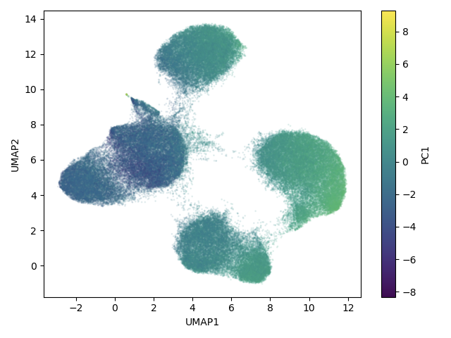
*UMAP embeddings colored by PC1 value (pc1/umap.png)*

<iframe src="https://widgets.figshare.com/articles/21171568/embed?show_title=1" width="568" height="351" allowfullscreen frameborder="0"></iframe>

*PC1: vol_000.mrc to vol_009.mrc; This shows one of the assembly pathways from Davis et al where the central protuberance is built before the rest of the complex.*


*UMAP embeddings colored by PC2 value (pc2/umap.png)*

<iframe src="https://widgets.figshare.com/articles/21171571/embed?show_title=1" width="568" height="351" allowfullscreen frameborder="0"></iframe>

*PC2: vol_000.mrc to vol_009.mrc; This shows another assembly pathway from Davis et al where the base is built before the rest of the complex.*

The `umap.png` plot within the `pcX` subdirectories shows the UMAP embedding of each particle, colored by its PCX value. This helps give a sense of the layout of the latent space and how the UMAP embedding is related to the PCA projection.

## 6) Particle filtering with the cryoDRGN Jupyter notebook

This section will walk through how to use the cryoDRGN Jupyter notebook, `cryoDRGN_filtering.ipynb`, to filter junk particles out of the dataset. The Jupyter notebook provides an interactive environment for running Python code blocks to analyze the cryoDRGN results.

### 6.1) Accessing the jupyter notebook

Jupyter is a web application that requires a browser to use. If you have browser access on the machine where you ran the cryodrgn experiment, you can start the jupyter notebook from the command line with the command `jupyter-notebook`:

```bash
(cryodrgn) $ jupyter-notebook
[I 14:47:21.672 NotebookApp] JupyterLab extension loaded from /Users/zhonge/anaconda3/envs/cryodrgn/lib/python3.7/site-packages/jupyterlab
[I 14:47:21.672 NotebookApp] JupyterLab application directory is /Users/zhonge/anaconda3/envs/cryodrgn/share/jupyter/lab
[I 14:47:21.674 NotebookApp] Serving notebooks from local directory: /Users/zhonge/dev/cryodrgn/master
[I 14:47:21.674 NotebookApp] Jupyter Notebook 6.1.4 is running at:
[I 14:47:21.674 NotebookApp] http://localhost:8888/?token=6e54c833c7da8c8c6e7c418feeb0dbbc76b0752a82d114f3
[I 14:47:21.674 NotebookApp]  or http://127.0.0.1:8888/?token=6e54c833c7da8c8c6e7c418feeb0dbbc76b0752a82d114f3
[I 14:47:21.674 NotebookApp] Use Control-C to stop this server and shut down all kernels (twice to skip confirmation).
[C 14:47:21.689 NotebookApp]

    To access the notebook, open this file in a browser:
        file:///Users/zhonge/Library/Jupyter/runtime/nbserver-67879-open.html
    Or copy and paste one of these URLs:
        http://localhost:8888/?token=6e54c833c7da8c8c6e7c418feeb0dbbc76b0752a82d114f3
     or http://127.0.0.1:8888/?token=6e54c833c7da8c8c6e7c418feeb0dbbc76b0752a82d114f3
```

If the cryodrgn training was performed on a *remote* machine (e.g. on a compute cluster), you can still view the notebook on your local machine (e.g. laptop) by setting up SSH port forwarding. For more information, see: [https://docs.anaconda.com/anaconda/user-guide/tasks/remote-jupyter-notebook/](https://docs.anaconda.com/anaconda/user-guide/tasks/remote-jupyter-notebook/).

```bash
# on the remote machine, start the jupyter notebook server in the cryodrgn workdir
(cryodrgn) $ jupyter-notebook --no-browser --port 8888 # specify an arbitrary port number > 1024

# on your local machine, open a unix terminal (or MS-DOS on Windows) and type the following command to set up the SSH tunnel
$ ssh -N -f -L localhost:8888:localhost:8888 remote_username@remote_host_name # replace remote_username and remote_host_name with your login information

# then navigate to a browser and type in localhost:8888 in the address bar
```

The port number can be set to an arbitrary number between 1024 through 49151 (as long as the port is unused). Jupyter should detect if a port is already in use and will automatically use the next (N+1) port number.

Here is a screenshot of the page that will show up in your browser. It should list all the files in that directory:

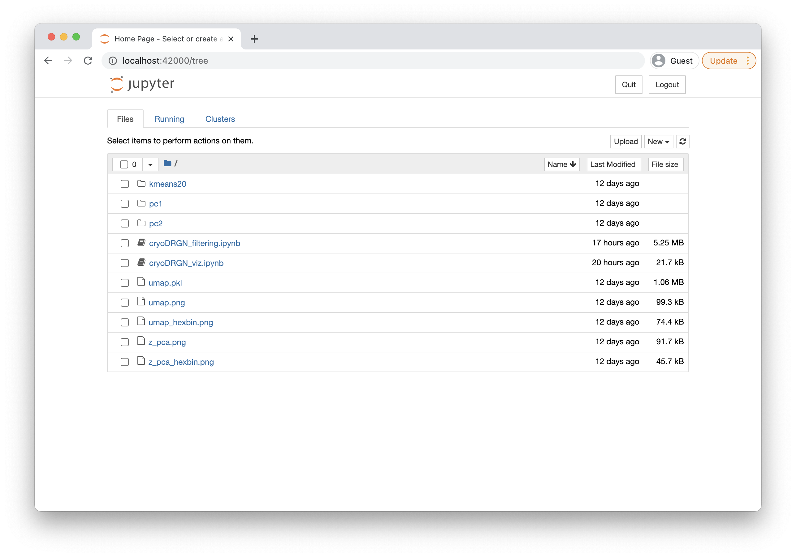

Then click cryoDRGN_filtering.ipynb to start the jupyter notebook:


### 6.2) Run the jupyter-notebook for particle filtering

The jupyter notebook has template code for performing all the analysis and plotting and should require minimal intervention. For a general overview of running jupyter notebooks, see their documentation here: [https://jupyter.readthedocs.io/en/latest/running.html](https://jupyter.readthedocs.io/en/latest/running.html).

The `cryoDRGN_filtering.ipynb` jupyter notebook has three methods for filtering particles:

1. clustering of the latent embeddings (k-means or Gaussian mixture model)
2. outlier detection (Z-score)
3. interactive selection with a lasso tool

For each method, the selected particles are tracked in the variable, `ind_selected`.

Once the selection has been finalized, the selected particles are saved into the cryoDRGN workdir as a `index.pkl` file at the end of the notebook. The selected indices can then be provided to cryoDRGN with the `--ind` argument to train a new model on a subset of the images or converted to `.star` file format.

For this tutorial, we will use the first method (GMM clustering) to follow the methodology used in Zhong et al. (See Extended Data Fig. 5). However, we will also demo the other methods, which you are welcome to explore.

To get started, first make sure the epoch number in the third cell is set to the correct epoch that we are analyzing. Since we have trained for 50 epochs, it should be set to 49 (0-based indexing).

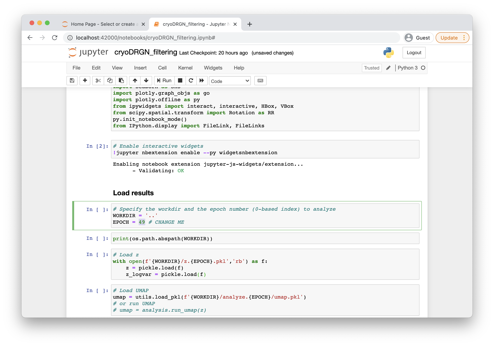

Set the variable EPOCH = N to the appropriate value.

Then run the cells of the notebook to load the relevant results until the first "Filtering by Cluster" section.

#### **Published filtering results**

This section shows the tutorial results colored by the filtered particles in the original publication of the dataset (Davis et al) and in the cryoDRGN paper (Zhong et al). For prospective analysis, the "junk" is usually identified by visualizing the reconstructed volumes and/or the particles images, and especially straightforward for edge/ice artifacts. The filtering may be validated by 2D classification or other traditional tools. In this dataset, the junk particles also have a very different pose distribution (not shown, but you can view this in the interactive visualization section of the jupyter notebook).

Davis et al 3D classification labels

(Optional) Add these code blocks in the jupyter notebook if you wish to generate these visualizations.

```bash
# deposited to https://zenodo.org/record/4355284
pub_classification_labels = utils.load_pkl('/path/to/published_labels_major.pkl')
```

```bash
analysis.plot_by_cluster(pc[:,0], pc[:,1], 6, pub_classification_labels)
plt.xlabel('PC1')
plt.ylabel('PC2')
```


```bash
analysis.plot_by_cluster(umap[:,0], umap[:,1], 6, pub_classification_labels)
plt.xlabel('UMAP1')
plt.ylabel('UMAP2')
```

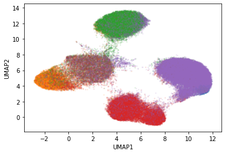

Zhong et al. filtering results: 96,532 kept particles and 35,367 removed particles

```bash
# obtained from https://github.com/zhonge/cryodrgn_empiar/blob/main/empiar10076/inputs/filtered.ind.pkl
pub_filtering = utils.load_pkl('/path/to/filtered_ind.pkl')
```

```bash
plt.scatter(pc[:,0], pc[:,1], alpha=.1, ms=1)
plt.scatter(pc[pub_filtering,0], pc[ind_filtering,1], alpha=.1, ms=1)
plt.xlabel('PC1')
plt.ylabel('PC2')
```

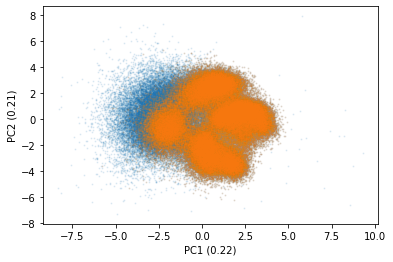

Kept particles are shown in orange

```bash
plt.scatter(pc[:,0], pc[:,1], alpha=.1, ms=1)
plt.scatter(pc[pub_filtering,0], pc[ind_filtering,1], alpha=.1, ms=1)
plt.xlabel('UMAP')
plt.ylabel('UMAP2')
```


Kept particles are shown in orange

In the next section, we will show the steps to remove the center cluster in the UMAP corresponding to the junk particles (the brown cluster in the 3D classification labels).

### 6.3) **Filtering by GMM cluster label**

In this section, we demo the steps and outputs for filtering out the junk cluster using a Gaussian mixture model (GMM) clustering algorithm.

The "Filtering by cluster" section of the Jupyter notebook has two subsections — filtering by kmeans clustering and by GMM clustering. You can try both options and play around with the cluster # and the random seed.

In the GMM-clustering section, change the cluster number (G=6 here) and rerun as necessary to get the desired clustering. Because GMM is a non-deterministic algorithm, the results are sensitive to the initial random seed. You can rerun the cells to try a different random seed.

Note that the clustering is performed on the latent embedding (`z`) and not on the umap embeddings (`umap`). This can be experimented with as well.


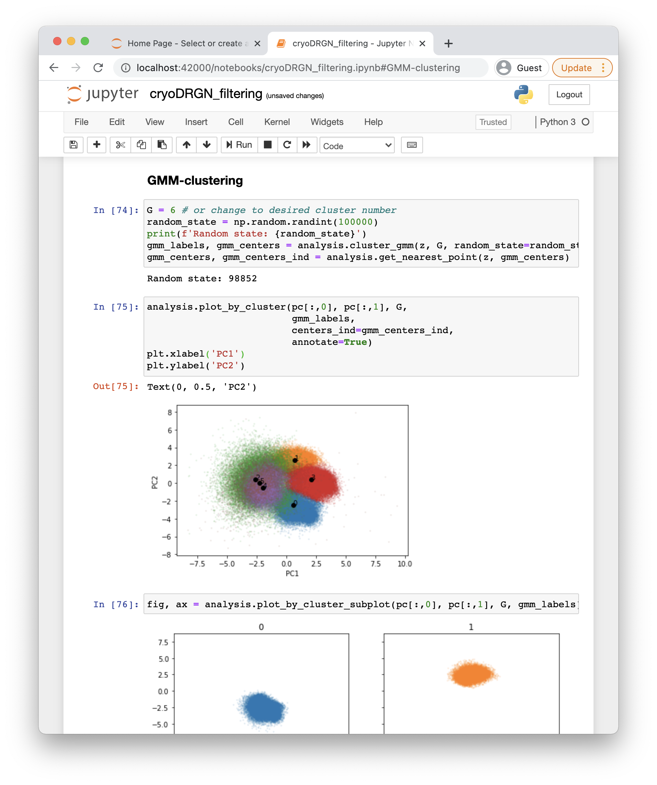

- The resulting 6 clusters:

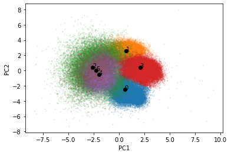


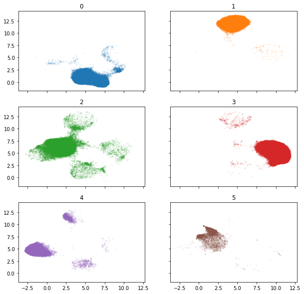

- Set clusters 2 and 5 (green and brown) as the bad/junk clusters. The code block will then identify the particles corresponding to those clusters.

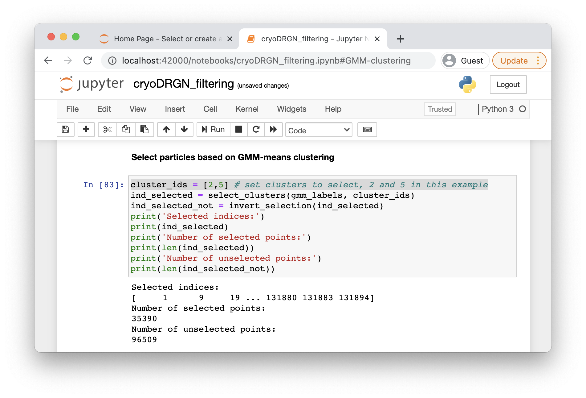

Select particles from clusters 2 and 5.

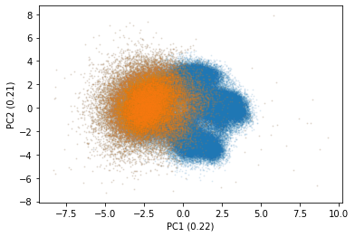

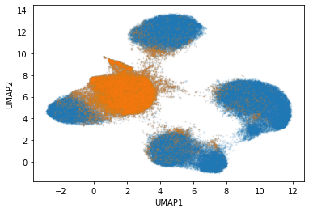

#### Alternative method: **Filtering by z-score**

In practice, we often find that junk particles are located as outliers in the distribution of latent embeddings. This section selects outlier particles by the magnitude of the embedding.

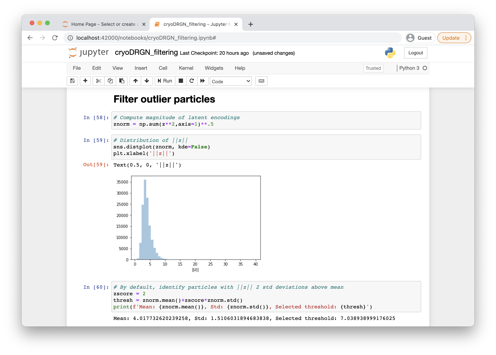

In cell 59, you can change the zscore to make the cutoff more or less stringent.

These plots will be automatically generated that help visualize which particles are selected

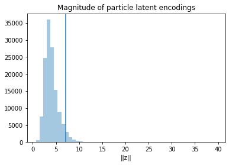

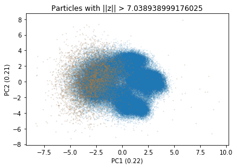

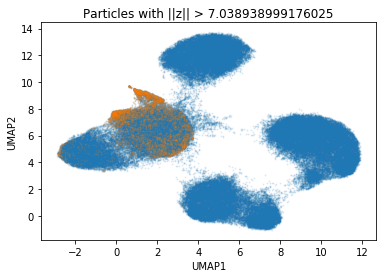

#### Alternative method: **Filtering with an interactive lasso tool**

Sometimes, the best clustering algorithm is the human eye (e.g. kmeans/GMM clustering algorithms can fail especially for small/oddly-shaped clusters). The cryoDRGN_filtering.ipynb notebook also provides an interactive widget that lets you interactively select regions of the latent space using a lasso tool.

When the widget first shows up, you will need to change the x-axis and y-axis labels to plot the particles by their UMAP embeddings. You can also change the plotting colors.

Note: Sometimes the tool struggles when there are >500k particles. This is a known issue.

Note: There have been installation issues with jupyter widgets on some linux systems. See [[link to github]](https://github.com/zhonge/cryodrgn/issues/34).


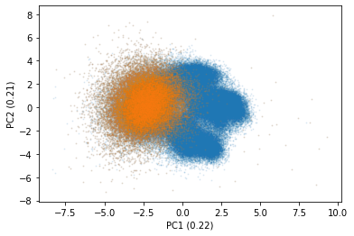


#### View the raw particles

The second to last section of the jupyter notebook contains code blocks for viewing the raw particle images. This section will visualize 9 images at random from the selected particles. This is sometimes useful for verifying that the selected particles are problematic in obvious cases of junk particles.


Cell 89 can be rerun to view a different selection of particles.


9 randomly selected particles from ind_selected


Location of the particles in latent space

#### Saving the selection

The last section of the notebook has cells that will help save the selected indices to use in downstream processing.

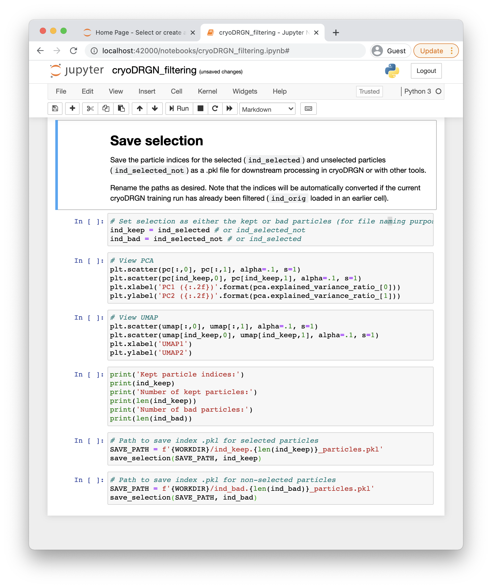

*Screenshot of the section*

In the filtering sections, the selected particles are tracked in the variable `ind_selected` and `ind_selected_not`. Because we selected the *bad particles*, we will now switch what the `ind_keep` and `ind_bad` variables are set to in the first cell. This is purely for organizational/file naming purposes.

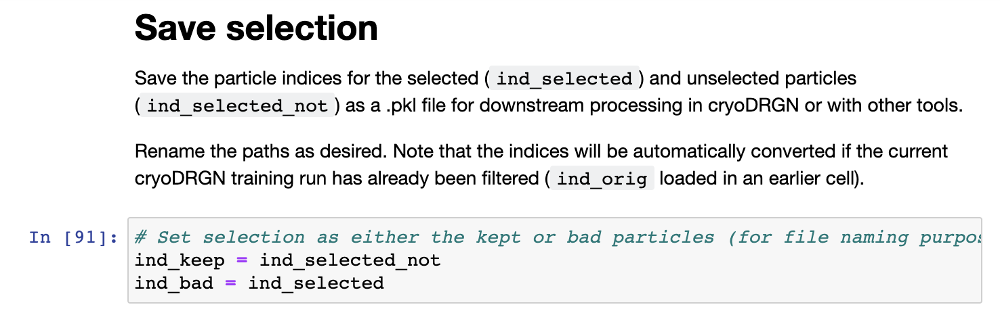
*Screenshot of the final section in cryoDRGN_filtering.ipynb*

Visualization of our kept particles, `ind_keep`:


*Viewing the kept particles (orange) in PCA space*


*Viewing the kept particles (orange) in UMAP space*

The last three cells will print out a summary of the selection and where the indices were saved:


After running these cells, there should be two files saved in the workdir of the cryodrgn job (the number of particles should be similar but most likely not identical):

- `ind_keep.96509_particles.pkl`
- `ind_bad.35390_particles.pkl`

These `.pkl` files contain a numpy array of indices into the particle stack, which can be provided to `cryodrgn train_vae` with the `--ind` flag to restrict training on the subset of the desired particle. This avoids having to extract a new particle stack.

#### (Additional Functionality) Writing a new .star file

- The selected particles can be converted to a .star file using `cryodrgn_utils write_star`. See Section 8.3 for more details on this script.

#### (Additional Functionality) Extracting a new particle stack

- A new particle stack can be extracted using the script `filter_mrcs.py` found in the `utils` subdirectory of the cryodrgn repository.

## 7) CryoDRGN high-resolution training

Now that we have identified the junk particles, we will rerun `cryodrgn train_vae` on larger, higher resolution images (D=256) using a larger neural network model (1024 dim x 3 layer architecture).

Example command to run on 1 GPU

```bash
$ cryodrgn train_vae data/256/particles.256.txt \
										--ctf data/ctf.pkl \
										--poses data/poses.pkl \
										--zdim 8 \
										-n 50 \
										--uninvert-data \ # needed for this dataset
										--enc-dim 1024 --enc-layers 3 \ # set the encoder architecture
										--dec-dim 1024 --dec-layers 3 \ # set the decoder architecture
										--ind tutorial/00/ind_keep.96509_particles.pkl
										-o tutorial/01_vae256 > tutorial_01.log
```

By providing the `--ind` argument, cryoDRGN will filter the list of particles, ctf parameters, and poses by the provided index array.

This is the most compute-intensive step of the tutorial. The training will take ~25 min/epoch on a single V100 GPU, requiring ~21 hours total for 50 epochs.

### **Accelerated training with GPU parallelization**

Use cryoDRGN's `--multigpu` flag to enable parallelized training across all detected GPUs on the machine. To select specific GPUs for cryoDRGN to run on, use the environmental variable `CUDA_VISIBLE_DEVICES`, e.g.:

```
$ cryodrgn train_vae ... # Run on GPU 0
$ cryodrgn train_vae ... --multigpu # Run on all GPUs on the machine
$ CUDA_VISIBLE_DEVICES=0,3 cryodrgn train_vae ... --multigpu # Run on GPU 0,3
```

When training is parallelized across multiple GPUs, the batch size (number of images trained in each mini-batch of SGD; default `-b 8`) will be automatically scaled by the number of available GPUs to better take advantage of parallelization. Depending on your compute resources, GPU utilization may be improved with `-b 16` (i.e. to achieve linear scaling of runtime with # GPUs). However, note that GPU parallelization, while leading to a faster wall-clock time per epoch, may require increasing the total number of epochs, since the training dynamics are affected (fewer model updates per epoch with larger `-b`).

### Accelerated training with mixed-precision mode

Mixed precision training is available for Nvidia GPUs with tensor core architectures and can lead to *order of magnitude* speedups in training. As of cryoDRGN version 1.1, mixed precision training is now automatically enabled (and can be turned off with the `--no-amp` flag).

**Note:** We recommend using `--multigpu` and `--amp` for larger architectures (1024x3) or larger images (D=256). For smaller models/images, GPU computation may not be the training bottleneck. In this case, GPU parallelization and mixed-precision training may have a limited effect on the wall clock training time, while taking up additional compute resources.

## 8) Analysis

We will first walk through the default outputs from `cryodrgn analyze` (Section 8.1), then we will use the cryoDRGN jupyter notebook to visualize and generate assembly state density maps (Section 8.2), extract the particles for newly identified state C4 (Section 8.3), and use cryoDRGN's graph traversal algorithm to generate trajectories of a ribosome assembly pathways (Section 8.4).

### 8.1) cryodrgn analyze

Similar to Step 5 above, we first run the default analysis pipeline with `cryodrgn analyze` :

- `$ cryodrgn analyze -h`

    ```
    (cryodrgn) $ cryodrgn analyze -h
    usage: cryodrgn analyze [-h] [--device DEVICE] [-o OUTDIR] [--skip-vol]
                            [--skip-umap] [--Apix APIX] [--flip] [-d DOWNSAMPLE]
                            [--pc PC] [--ksample KSAMPLE]
                            workdir epoch

    Visualize latent space and generate volumes

    positional arguments:
      workdir               Directory with cryoDRGN results
      epoch                 Epoch number N to analyze (0-based indexing,
                            corresponding to z.N.pkl, weights.N.pkl)

    optional arguments:
      -h, --help            show this help message and exit
      --device DEVICE       Optionally specify CUDA device
      -o OUTDIR, --outdir OUTDIR
                            Output directory for analysis results (default:
                            [workdir]/analyze.[epoch])
      --skip-vol            Skip generation of volumes
      --skip-umap           Skip running UMAP

    Extra arguments for volume generation:
      --Apix APIX           Pixel size to add to .mrc header (default: 1 A/pix)
      --flip                Flip handedness of output volume
      -d DOWNSAMPLE, --downsample DOWNSAMPLE
                            Downsample volumes to this box size (pixels)
      --pc PC               Number of principal component traversals to generate
                            (default: 2)
      --ksample KSAMPLE     Number of kmeans samples to generate (default: 20)
      --vol-start-index VOL_START_INDEX
                            Default value of start index for volume generation (default: 0)
    ```


Example command: (1 GPU, ~10 min)

```bash
# Usage: cryodrgn analyze [workdir] [epoch]
$ cryodrgn analyze tutorial/01_vae256 49 --Apix 1.6375 --flip
```

We flip the handedness of the output volumes with the flag `--flip` and set the pixel size in the mrc header with `--Apix`:

- Output log

    ```bash
    2021-02-28 14:24:49     Saving results to /nobackup/users/zhonge/cryodrgn/11_l17_ribo/04_vae256_gpu/3_gpu1_b8/analyze.49
    2021-02-28 14:24:49     Perfoming principal component analysis...
    2021-02-28 14:24:49     Explained variance ratio:
    2021-02-28 14:24:49     [0.21076616 0.1977381  0.11697037 0.09955638 0.0985605  0.09767462
     0.09139399 0.08733987]
    2021-02-28 14:24:49     Generating volumes...
    2021-02-28 14:24:49     Running command:
    cryodrgn eval_vol /nobackup/users/zhonge/cryodrgn/11_l17_ribo/04_vae256_gpu/3_gpu1_b8/weights.49.pkl --config /nobackup/users/zhonge/cryodrgn/11_l17_ribo/04_vae256_gpu/3_gpu1_b8/config.yaml --zfile /nobackup/users/zhonge/cryodrgn/11_l17_ribo/04_vae256_gpu/3_gpu1_b8/analyze.49/pc1/z_values.txt -o /nobackup/users/zhonge/cryodrgn/11_l17_ribo/04_vae256_gpu/3_gpu1_b8/analyze.49/pc1 --Apix 1
    2021-02-28 14:24:50     Use cuda True
    2021-02-28 14:24:50     Namespace(Apix=1.0, D=None, activation='relu', config='/nobackup/users/zhonge/cryodrgn/11_l17_ribo/04_vae256_gpu/3_gpu1_b8/config.yaml', domain=None, downsample=None, enc_mask=None, encode_mode=None, flip=False, func=<function main at 0x2000ac580e18>, l_extent=None, n=10, norm=None, o='/nobackup/users/zhonge/cryodrgn/11_l17_ribo/04_vae256_gpu/3_gpu1_b8/analyze.49/pc1', pdim=None, pe_dim=None, pe_type=None, players=None, prefix='vol_', qdim=None, qlayers=None, verbose=False, weights='/nobackup/users/zhonge/cryodrgn/11_l17_ribo/04_vae256_gpu/3_gpu1_b8/weights.49.pkl', z=None, z_end=None, z_start=None, zdim=None, zfile='/nobackup/users/zhonge/cryodrgn/11_l17_ribo/04_vae256_gpu/3_gpu1_b8/analyze.49/pc1/z_values.txt')
    2021-02-28 14:24:50     Loaded configuration:
    {'dataset_args': {'ctf': '/nobackup/users/zhonge/cryodrgn/11_l17_ribo/data/ctf.new.pkl',
                      'datadir': None,
                      'do_pose_sgd': False,
                      'ind': '/nobackup/users/zhonge/cryodrgn/11_l17_ribo/aux/ind2.train.pkl',
                      'invert_data': False,
                      'keepreal': False,
                      'norm': [0, 325.65057],
                      'particles': '/nobackup/users/zhonge/cryodrgn/11_l17_ribo/data/256/projections.txt',
                      'poses': '/nobackup/users/zhonge/cryodrgn/11_l17_ribo/data/pose.pkl',
                      'window': False},
     'lattice_args': {'D': 257, 'extent': 0.5, 'ignore_DC': True},
     'model_args': {'activation': 'relu',
                    'domain': 'fourier',
                    'enc_mask': 128,
                    'encode_mode': 'resid',
                    'pdim': 1024,
                    'pe_dim': None,
                    'pe_type': 'geom_lowf',
                    'players': 3,
                    'qdim': 1024,
                    'qlayers': 3,
                    'zdim': 8},
     'seed': 21152}
    2021-02-28 14:24:56     Using circular lattice with radius 128
    2021-02-28 14:24:56     Generating 10 volumes
    2021-02-28 14:24:56     [-0.13908401 -0.66560406  0.95547887 -0.6795193   2.33642701  2.05639807
     -1.21175412 -2.10233111]
    2021-02-28 14:25:06     [-0.13527223 -0.48584066  0.75453086 -0.51289588  1.81356009  1.58481893
     -0.9511668  -1.6463648 ]
    2021-02-28 14:25:15     [-0.13146044 -0.30607727  0.55358285 -0.34627247  1.29069317  1.11323979
     -0.69057947 -1.19039849]
    2021-02-28 14:25:23     [-0.12764866 -0.12631387  0.35263484 -0.17964905  0.76782624  0.64166065
     -0.42999215 -0.73443218]
    2021-02-28 14:25:32     [-0.12383687  0.05344952  0.15168683 -0.01302564  0.24495932  0.1700815
     -0.16940482 -0.27846588]
    2021-02-28 14:25:41     [-0.12002508  0.23321291 -0.04926117  0.15359777 -0.2779076  -0.30149764
      0.09118251  0.17750043]
    2021-02-28 14:25:49     [-0.1162133   0.41297631 -0.25020918  0.32022119 -0.80077453 -0.77307678
      0.35176983  0.63346674]
    2021-02-28 14:25:58     [-0.11240151  0.5927397  -0.45115719  0.4868446  -1.32364145 -1.24465592
      0.61235716  1.08943305]
    2021-02-28 14:26:07     [-0.10858973  0.7725031  -0.6521052   0.65346802 -1.84650837 -1.71623506
      0.87294448  1.54539936]
    2021-02-28 14:26:15     [-0.10477794  0.95226649 -0.85305321  0.82009143 -2.3693753  -2.1878142
      1.13353181  2.00136567]
    2021-02-28 14:26:24     Finsihed in 0:01:33.787293
    2021-02-28 14:26:25     Running command:
    cryodrgn eval_vol /nobackup/users/zhonge/cryodrgn/11_l17_ribo/04_vae256_gpu/3_gpu1_b8/weights.49.pkl --config /nobackup/users/zhonge/cryodrgn/11_l17_ribo/04_vae256_gpu/3_gpu1_b8/config.yaml --zfile /nobackup/users/zhonge/cryodrgn/11_l17_ribo/04_vae256_gpu/3_gpu1_b8/analyze.49/pc2/z_values.txt -o /nobackup/users/zhonge/cryodrgn/11_l17_ribo/04_vae256_gpu/3_gpu1_b8/analyze.49/pc2 --Apix 1
    2021-02-28 14:26:27     Use cuda True
    2021-02-28 14:26:27     Namespace(Apix=1.0, D=None, activation='relu', config='/nobackup/users/zhonge/cryodrgn/11_l17_ribo/04_vae256_gpu/3_gpu1_b8/config.yaml', domain=None, downsample=None, enc_mask=None, encode_mode=None, flip=False, func=<function main at 0x2000ac580e18>, l_extent=None, n=10, norm=None, o='/nobackup/users/zhonge/cryodrgn/11_l17_ribo/04_vae256_gpu/3_gpu1_b8/analyze.49/pc2', pdim=None, pe_dim=None, pe_type=None, players=None, prefix='vol_', qdim=None, qlayers=None, verbose=False, weights='/nobackup/users/zhonge/cryodrgn/11_l17_ribo/04_vae256_gpu/3_gpu1_b8/weights.49.pkl', z=None, z_end=None, z_start=None, zdim=None, zfile='/nobackup/users/zhonge/cryodrgn/11_l17_ribo/04_vae256_gpu/3_gpu1_b8/analyze.49/pc2/z_values.txt')
    2021-02-28 14:26:27     Loaded configuration:
    {'dataset_args': {'ctf': '/nobackup/users/zhonge/cryodrgn/11_l17_ribo/data/ctf.new.pkl',
                      'datadir': None,
                      'do_pose_sgd': False,
                      'ind': '/nobackup/users/zhonge/cryodrgn/11_l17_ribo/aux/ind2.train.pkl',
                      'invert_data': False,
                      'keepreal': False,
                      'norm': [0, 325.65057],
                      'particles': '/nobackup/users/zhonge/cryodrgn/11_l17_ribo/data/256/projections.txt',
                      'poses': '/nobackup/users/zhonge/cryodrgn/11_l17_ribo/data/pose.pkl',
                      'window': False},
     'lattice_args': {'D': 257, 'extent': 0.5, 'ignore_DC': True},
     'model_args': {'activation': 'relu',
                    'domain': 'fourier',
                    'enc_mask': 128,
                    'encode_mode': 'resid',
                    'pdim': 1024,
                    'pe_dim': None,
                    'pe_type': 'geom_lowf',
                    'players': 3,
                    'qdim': 1024,
                    'qlayers': 3,
                    'zdim': 8},
     'seed': 21152}
    2021-02-28 14:26:28     Using circular lattice with radius 128
    2021-02-28 14:26:29     Generating 10 volumes
    2021-02-28 14:26:29     [-0.23653386 -2.73221812  0.08971123  0.73753149 -1.50277524 -0.29134391
      0.51194909 -1.28563224]
    2021-02-28 14:26:38     [-0.20853919 -2.02861518  0.07751347  0.57718157 -1.1477155  -0.24292948
      0.38124093 -0.97811094]
    2021-02-28 14:26:46     [-0.18054453 -1.32501224  0.06531572  0.41683164 -0.79265575 -0.19451505
      0.25053277 -0.67058963]
    2021-02-28 14:26:55     [-0.15254986 -0.6214093   0.05311796  0.25648172 -0.43759601 -0.14610062
      0.11982461 -0.36306833]
    2021-02-28 14:27:04     [-0.12455519  0.08219364  0.0409202   0.09613179 -0.08253627 -0.09768618
     -0.01088355 -0.05554702]
    2021-02-28 14:27:12     [-0.09656052  0.78579658  0.02872244 -0.06421813  0.27252347 -0.04927175
     -0.14159171  0.25197428]
    2021-02-28 14:27:21     [-6.85658553e-02  1.48939952e+00  1.65246763e-02 -2.24568055e-01
      6.27583215e-01 -8.57319322e-04 -2.72299871e-01  5.59495585e-01]
    2021-02-28 14:27:30     [-0.04057119  2.19300245  0.00432692 -0.38491798  0.98264296  0.04755711
     -0.40300803  0.86701689]
    2021-02-28 14:27:38     [-0.01257652  2.89660539 -0.00787084 -0.5452679   1.3377027   0.09597154
     -0.53371619  1.17453819]
    2021-02-28 14:27:47     [ 0.01541815  3.60020833 -0.0200686  -0.70561783  1.69276244  0.14438598
     -0.66442435  1.4820595 ]
    2021-02-28 14:27:56     Finsihed in 0:01:29.431088
    2021-02-28 14:27:56     K-means clustering...
    2021-02-28 14:28:01     Generating volumes...
    2021-02-28 14:28:01     Running command:
    cryodrgn eval_vol /nobackup/users/zhonge/cryodrgn/11_l17_ribo/04_vae256_gpu/3_gpu1_b8/weights.49.pkl --config /nobackup/users/zhonge/cryodrgn/11_l17_ribo/04_vae256_gpu/3_gpu1_b8/config.yaml --zfile /nobackup/users/zhonge/cryodrgn/11_l17_ribo/04_vae256_gpu/3_gpu1_b8/analyze.49/kmeans20/z_values.txt -o /nobackup/users/zhonge/cryodrgn/11_l17_ribo/04_vae256_gpu/3_gpu1_b8/analyze.49/kmeans20 --Apix 1
    2021-02-28 14:28:03     Use cuda True
    2021-02-28 14:28:03     Namespace(Apix=1.0, D=None, activation='relu', config='/nobackup/users/zhonge/cryodrgn/11_l17_ribo/04_vae256_gpu/3_gpu1_b8/config.yaml', domain=None, downsample=None, enc_mask=None, encode_mode=None, flip=False, func=<function main at 0x2000ac580e18>, l_extent=None, n=10, norm=None, o='/nobackup/users/zhonge/cryodrgn/11_l17_ribo/04_vae256_gpu/3_gpu1_b8/analyze.49/kmeans20', pdim=None, pe_dim=None, pe_type=None, players=None, prefix='vol_', qdim=None, qlayers=None, verbose=False, weights='/nobackup/users/zhonge/cryodrgn/11_l17_ribo/04_vae256_gpu/3_gpu1_b8/weights.49.pkl', z=None, z_end=None, z_start=None, zdim=None, zfile='/nobackup/users/zhonge/cryodrgn/11_l17_ribo/04_vae256_gpu/3_gpu1_b8/analyze.49/kmeans20/z_values.txt')
    2021-02-28 14:28:03     Loaded configuration:
    {'dataset_args': {'ctf': '/nobackup/users/zhonge/cryodrgn/11_l17_ribo/data/ctf.new.pkl',
                      'datadir': None,
                      'do_pose_sgd': False,
                      'ind': '/nobackup/users/zhonge/cryodrgn/11_l17_ribo/aux/ind2.train.pkl',
                      'invert_data': False,
                      'keepreal': False,
                      'norm': [0, 325.65057],
                      'particles': '/nobackup/users/zhonge/cryodrgn/11_l17_ribo/data/256/projections.txt',
                      'poses': '/nobackup/users/zhonge/cryodrgn/11_l17_ribo/data/pose.pkl',
                      'window': False},
     'lattice_args': {'D': 257, 'extent': 0.5, 'ignore_DC': True},
     'model_args': {'activation': 'relu',
                    'domain': 'fourier',
                    'enc_mask': 128,
                    'encode_mode': 'resid',
                    'pdim': 1024,
                    'pe_dim': None,
                    'pe_type': 'geom_lowf',
                    'players': 3,
                    'qdim': 1024,
                    'qlayers': 3,
                    'zdim': 8},
     'seed': 21152}
    2021-02-28 14:28:04     Using circular lattice with radius 128
    2021-02-28 14:28:05     Generating 20 volumes
    2021-02-28 14:28:05     [-1.45019531 -1.14550781  0.06768799 -0.26074219 -1.40332031  0.63574219
     -0.65576172 -3.86523438]
    2021-02-28 14:28:14     [ 0.71191406 -1.34570312 -1.46777344  2.5078125   0.31176758 -0.37353516
     -1.26367188 -0.44970703]
    2021-02-28 14:28:22     [ 0.0526123  -3.54492188 -0.11004639 -1.203125    1.15429688  0.99072266
     -1.21777344 -1.796875  ]
    2021-02-28 14:28:31     [ 0.37890625 -1.99902344  1.69921875  0.80175781 -0.14501953  1.3984375
     -0.59619141 -0.50732422]
    2021-02-28 14:28:40     [ 1.34179688 -0.81445312  1.42382812  0.95751953  1.82324219 -0.29614258
      0.68896484 -1.44140625]
    2021-02-28 14:28:49     [-2.7734375   0.28222656  0.20996094  1.68554688 -0.72167969 -1.94433594
     -1.87402344  0.43188477]
    2021-02-28 14:28:57     [ 2.0234375   0.16711426  0.40917969  1.89941406 -1.24902344 -3.1953125
      0.54736328  0.80371094]
    2021-02-28 14:29:06     [ 1.54495239e-03 -2.34179688e+00 -8.84765625e-01 -1.37207031e+00
     -2.89648438e+00 -7.03125000e-01 -3.58642578e-01  4.86145020e-02]
    2021-02-28 14:29:15     [ 0.56298828 -1.85449219 -1.29003906  1.12011719 -2.30859375 -1.21777344
      1.09960938  1.78027344]
    2021-02-28 14:29:23     [-1.92382812 -2.53125     0.17822266  1.21386719  0.18640137  0.56542969
      1.14648438  0.16760254]
    2021-02-28 14:29:32     [-0.76513672 -0.51318359  0.98779297  1.11328125 -2.30078125 -0.34350586
      2.07226562 -0.29492188]
    2021-02-28 14:29:41     [ 0.08319092  2.77148438 -1.41992188  0.32055664 -1.33886719  0.69873047
      0.36987305  3.66601562]
    2021-02-28 14:29:49     [-1.55566406  2.93359375  0.62402344 -1.88378906 -0.35253906 -0.8515625
      1.06835938  2.41015625]
    2021-02-28 14:29:58     [ 0.25854492  2.3125     -0.97119141 -1.78320312  0.2220459  -3.63476562
      0.96826172  2.15625   ]
    2021-02-28 14:30:07     [ 0.64306641  2.70117188 -0.85791016 -0.04754639  2.31054688  3.125
     -1.95703125  0.05780029]
    2021-02-28 14:30:15     [-0.3605957   0.45092773  1.70800781 -2.24804688  3.0390625   1.54492188
     -0.83007812 -0.16125488]
    2021-02-28 14:30:24     [ 1.39355469  2.33789062  2.18164062 -0.00338936  2.87109375  0.89550781
     -0.84960938  0.14160156]
    2021-02-28 14:30:33     [ 0.47851562  2.55273438 -0.328125   -0.96533203 -0.6796875   1.35449219
      1.08007812 -1.60253906]
    2021-02-28 14:30:41     [-0.38061523  1.22949219 -1.48046875 -0.50439453  2.12890625 -0.9296875
     -0.40283203  0.62597656]
    2021-02-28 14:30:50     [-2.12695312  2.45507812  0.38671875  1.51757812  0.96386719  1.17089844
      1.08300781  0.84228516]
    2021-02-28 14:30:59     Finsihed in 0:02:56.162816
    2021-02-28 14:30:59     Running UMAP...
    2021-02-28 14:33:00     Generating plots...
    2021-02-28 14:33:13     /nobackup/users/zhonge/cryodrgn/11_l17_ribo/04_vae256_gpu/3_gpu1_b8/analyze.49/cryoDRGN_viz.ipynb already exists. Skipping
    2021-02-28 14:33:13     /nobackup/users/zhonge/cryodrgn/11_l17_ribo/04_vae256_gpu/3_gpu1_b8/analyze.49/cryoDRGN_viz.ipynb
    2021-02-28 14:33:13     Creating jupyter notebook...
    2021-02-28 14:33:14     /nobackup/users/zhonge/cryodrgn/11_l17_ribo/04_vae256_gpu/3_gpu1_b8/analyze.49/cryoDRGN_filtering.ipynb
    2021-02-28 14:33:14     Finished in 0:08:25.218678
    ```

As before, this will create a new directory `analyze.49` in the workdir of the cryodrgn job containing UMAP/PCA visualizations of the latent space, 20 sampled density maps at kmeans cluster centers, 10 density maps along PC1 and PC2, and jupyter notebooks for interactive analysis.

Additional usage notes:

- The output volumes will be 256^3. To generate downsampled volumes (e.g. to take up less disk space), use the argument `-d`.
- More volumes can be generated with `--ksample N`
- More PCs (up to the dimension of the latent variable) can be generated with `--pc N`
- The pixel size and handedness of a `.mrc` file can also be modified later with the scripts `add_psize.py` and `flip_hand.py` in the `utils` subdirectory of the cryodrgn repository.
- The argument `--vol-start-index` (default `0`) dictates the starting index of `.mrc` filenames for generated volumes (`vol_nnn.mrc`). You may want to set this to `1` if, for example you are using `ChimeraX` to visualize these maps, which by convention numbers all maps that it opens from `1`.

#### Visualization of the latent space

Because we trained an 8-dimensional latent variable model (`—-zdim 8`),  PCA (a linear dimensionality reduction technique) and UMAP (a nonlinear dimensionality technique) are used to visualize the distribution of particle latent embeddings.

PCA  scatter plot (left) and density plot (right)

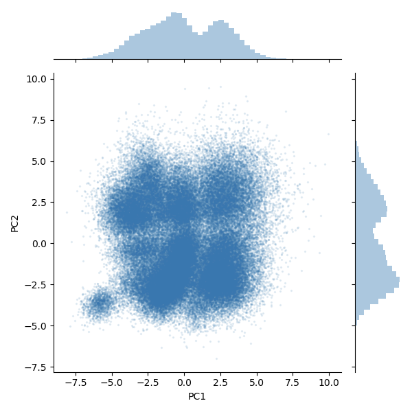

z_pca.png

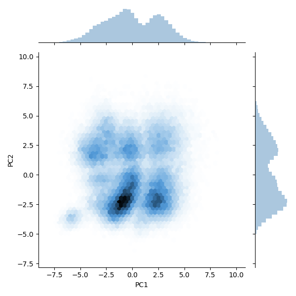

z_pca_hexbin.png

UMAP scatter plot (left) and density plot (right)

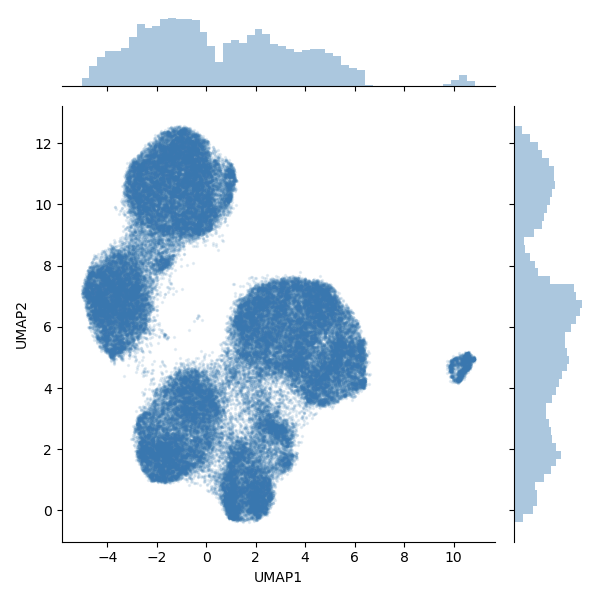

umap.png

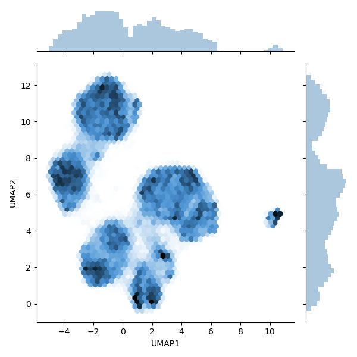

umap_hexbin.png

The layout of the latent space reproduces the original results shown in Fig 5F of Zhong et al up to the trivial inversion of UMAP2 axis.

#### Default sampled density maps

`cryodrgn analyze` uses the k-means clustering algorithm to *partition* the latent space into regions (by default k=20 regions), and generate a density map from the center of each of these regions. The goal is to provide a tractable number of representative density maps to visually inspect.

Additional usage notes:

The number of partitions can be updated with the argument `--ksample 50` to change the number of density maps to e.g. 50.

```bash
# contents of the directory
(cryodrgn) $ ls tutorial/01_vae256/analyze.49/kmeans20/
centers_ind.txt  umap.png     vol_003.mrc  vol_007.mrc  vol_011.mrc  vol_015.mrc  vol_019.mrc
centers.txt      vol_000.mrc  vol_004.mrc  vol_008.mrc  vol_012.mrc  vol_016.mrc  z_pca_hex.png
labels.pkl       vol_001.mrc  vol_005.mrc  vol_009.mrc  vol_013.mrc  vol_017.mrc  z_pca.png
umap_hex.png     vol_002.mrc  vol_006.mrc  vol_010.mrc  vol_014.mrc  vol_018.mrc  z_values.txt
```

<iframe src="https://widgets.figshare.com/articles/21171025/embed?show_title=1" width="568" height="351" allowfullscreen frameborder="0"></iframe>


*Location of the twenty volumes in the UMAP visualization*

#### PC trajectories

There are two subdirectories in the analysis directory that will contain volumes generated along the first and second principal components (PC) of the latent space. By default, the volumes are generated at equally spaced points between the first and 99th percentile of the distribution projected onto each principal component (e.g. Fig 6c of Zhong et al).

- Note 1: The PC trajectories can give a sense of the variability in the structure, however, the principal components of cryoDRGN's *latent space* are not principal components of the volumes due to the nonlinear nature of the decoder.
- Note 2: Principal component trajectories can also produce nonphysical "motions", e.g. if there is discrete variability in the structure.

Additional usage notes:

- Use `--pc` to change the number of PCs that are generated by `cryodrgn analyze`
- For more flexibility in usage, see `cryodrgn pc_traversal`

```bash
(cryodrgn) $ ls tutorial/01_vae256/analyze.49/pc1/
umap.png     vol_001.mrc  vol_003.mrc  vol_005.mrc  vol_007.mrc  vol_009.mrc
vol_000.mrc  vol_002.mrc  vol_004.mrc  vol_006.mrc  vol_008.mrc  z_values.txt
(cryodrgn) $ ls tutorial/01_vae256/analyze.49/pc2/
umap.png     vol_001.mrc  vol_003.mrc  vol_005.mrc  vol_007.mrc  vol_009.mrc
vol_000.mrc  vol_002.mrc  vol_004.mrc  vol_006.mrc  vol_008.mrc  z_values.txt
```

##### PC1 volumes

<iframe src="https://widgets.figshare.com/articles/21171079/embed?show_title=1" width="568" height="351" allowfullscreen frameborder="0"></iframe>

*PC1: vol_000.mrc to vol_009.mrc; This shows one of the assembly pathways from Davis et al where the central protuberance is built before the rest of the complex.*

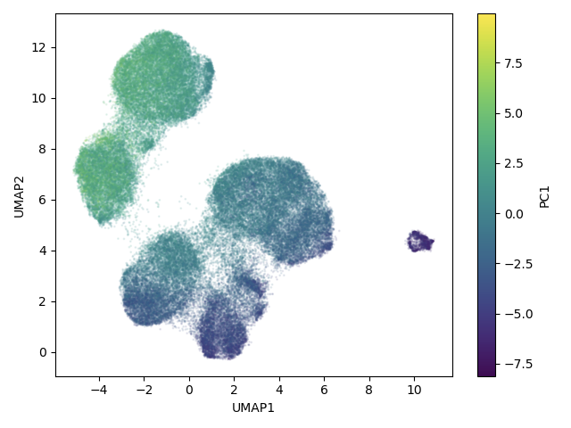
*UMAP embeddings colored by PC1 value (pc1/umap.png)*

##### PC2 volumes

<iframe src="https://widgets.figshare.com/articles/21171088/embed?show_title=1" width="568" height="351" allowfullscreen frameborder="0"></iframe>

*PC2: vol_000.mrc to vol_009.mrc; This shows another assembly pathway from Davis et al where the base is built before the rest of the complex.*


*UMAP embeddings colored by PC2 value*

The umap.png plots within the pcX subdirectories show the UMAP embedding colored by each particle's projected value along PCX. This helps give a sense of the layout of the latent space and how the UMAP embedding (a nonlinear 8D → 2D embedding) is related to the PCA projection (a linear projection from 8D → 2D).

(step8-2)=
### 8.2) The cryoDRGN jupyter notebook

CryoDRGN provides a jupyter notebook, `cryoDRGN_viz.ipynb`, which contains more visualization tools to facilitate interactive exploration of the trained model.

#### Starting the jupyter notebook

See Section 6.1.

#### Running the jupyter notebook

- Make sure the epoch number specified in the third cell is set to the correct epoch that we are analyzing. Since we have trained for 50 epochs, it should be 49 here (0-based indexing).
- Then, you can run each cell one by one to see the outputs. Alternatively, you can run the entire notebook in one go with Cell → Run All.
- Additional plots in the Jupyter notebook include:
    - Plot of the learning curve (i.e. average loss per epoch)

        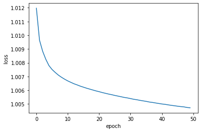

    - Plot of the pose distribution

        

        

        

- In the "Interactive visualization" section, any per-particle cryoDRGN data are loaded into an interactive widget for visualization.
- Advanced usage: Additional data series may be added to the pandas dataframe and will automatically show up in the widget.

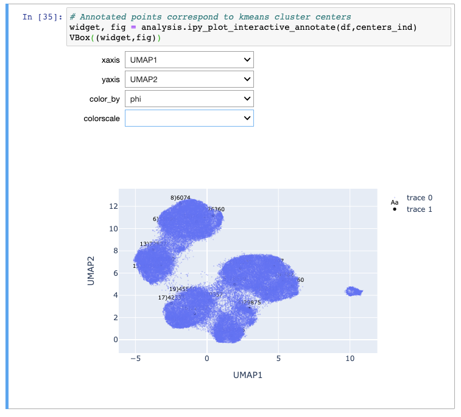

Selected the desired x and y axis data series.


label: kmeans20 labels
theta/phi/psi: Euler angles
tx/ty: Translations
df1/df2/dfang/phase: defocus parameters
index: particle ordering

As a debugging tool, it is sometimes useful to visualize the latent space colored by pose or CTF parameters. Regions of the latent space are enriched in particular viewing directions or defocus values may be a sign that the latent variable is modeling these imaging variations instead of structural heterogeneity.


#### Comparing to 3D classification labels

(Optional) Add these code blocks in the jupyter notebook after the data loading sectio to plot by 3D classification labels for major states and minor assembly states.

```bash
# Download from https://zenodo.org/record/4355284
pub_labels = utils.load_pkl('path/to/published_labels.pkl')
pub_labels_major = utils.load_pkl('path/to/published_labels_major.pkl')

# get labels for filtered particles
pub_labels = pub_labels[ind_orig] # ind_orig is loaded in cell 11 of the jupyter notebook
pub_labels_major = pub_labels_major[ind_orig]
```

Plot major classes

```bash
# get cluster centers for major classes
major_centers = []
for i in range(5):
    zsub = z[pub_labels_major == i]
    major_centers.append(np.mean(zsub,axis=0))
major_centers = np.array(major_centers)
major_centers2, major_centers_i = analysis.get_nearest_point(z,major_centers)
```

Plot minor classes

```bash
# get cluster centers for minor classes
minor_centers = []
for i in range(14):
    zsub = z[pub_labels == i]
    minor_centers.append(np.mean(zsub,axis=0))
minor_centers = np.array(minor_centers)
minor_centers2, minor_centers_i = analysis.get_nearest_point(z,minor_centers)
```

```bash
analysis.plot_by_cluster(umap[:,0],umap[:,1],5,pub_labels_major,centers_ind=major_centers_i,annotate=True)
```


```bash
colors = ['C0','C1',
         'C2','C8','green',
         'C3','orangered','maroon','lightcoral',
          'C4','slateblue','magenta','blueviolet','plum']

analysis.plot_by_cluster(umap[:,0],umap[:,1],14,pub_labels,centers_ind=minor_centers_i,annotate=True,colors=colors)
```

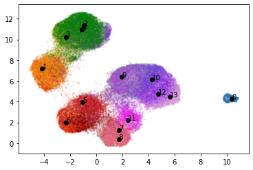

#### Generating additional volumes

To generate the volumes associated with each of these assembly states, we can use the last section of the jupyter notebook:

- For the variable `vol_ind`, replace the empty list with the indices corresponding to the assembly state cluster centers:

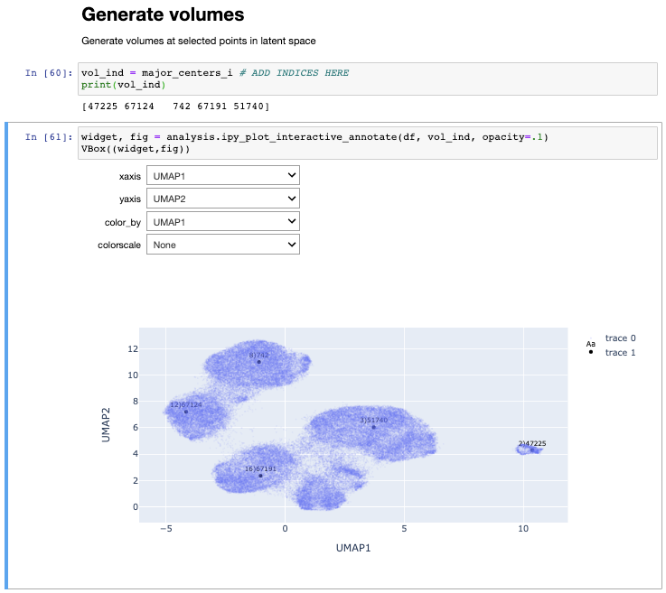

- The next cell automatically creates a clean output directory, but you can also define your own, e.g. `outdir = "major_states"` .
- Then run the final cell to generate volumes at the values of `z` at the indices defined with `vol_ind`. The volumes will be saved in the specified directory. The cell will also return links to directly download the file into your Downloads folder, which is helpful if accessing the jupyter notebook via ssh.

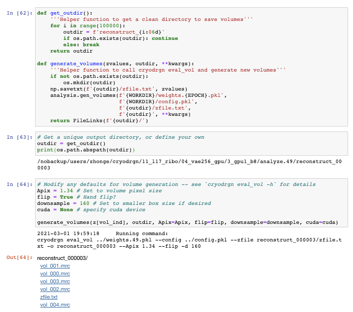

### 8.3) Extracting particles for traditional refinement

In [Zhong et al](https://www.nature.com/articles/s41592-020-01049-4), we identified a new assembly state, C4, which was validated with traditional refinement (see Figure 5F). This section shows how to use the interactive lasso tool to select particles from a region of the latent space and save the particles in .star file format.

#### Interactive selection

Use the interactive lasso tool to select the small cluster of particles near the class C megacluster. The table below the plot will update with the indices of the selected datapoints.

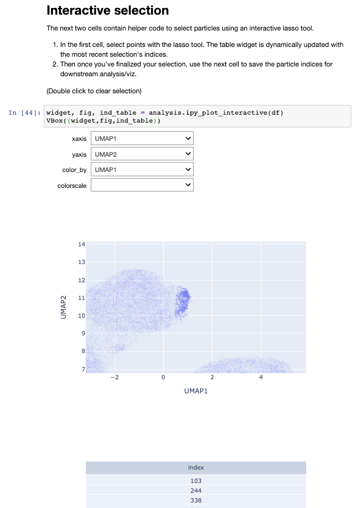


Then, evaluate the next cell to save the selected particles into the variable `ind_selected`. In this example, 1146 particles were selected.

Note: A representative C4 structure from cryoDRGN can be generated with the **Volume Generation** section of the notebook. Give it a try!

Evaluate the next few cells to view the selection in PCA and UMAP space:


In the next section of the jupyter notebook, there is template code for saving the index selection. Rename the path as `ind_selected_classC4.pkl` and evaluate the cells to save the selection as an index .pkl file.  We will convert it to a .star file in the next step.

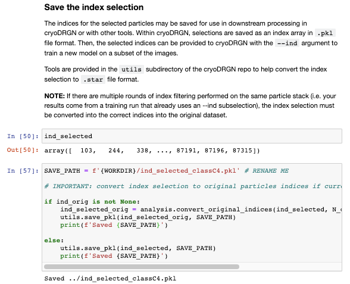

**Note:** An index selection saved as a .pkl file can also be generated from clustering tools in the `cryoDRGN_filtering.ipnyb` jupyter notebook. See Section 6.3.

### Converting to a .star file

The `cryodrgn_utils write_star` tool can be used to convert the index `.pkl` of selected particles (and the input particles `.mrcs`, and optionally the ctf and/or pose `.pkl`) to `.star` file format:

- `$ cryodrgn_utils write_star -h`

    ```bash
    (cryodrgn) $ cryodrgn_utils write_star -h
    usage: cryodrgn_utils write_star [-h] [--ctf CTF] [--poses POSES] [--ind IND] [--full-path] -o O particles

    Create a Relion 3.0 star file from a particle stack and ctf parameters

    positional arguments:
      particles            Input particles (.mrcs, .txt)

    optional arguments:
      -h, --help           show this help message and exit
      --ctf CTF            Optionally include ctf information from a .pkl file
      --poses POSES        Optionally include pose information from a .pkl file
      --ind IND            Optionally filter by selected index array (.pkl)
      --full-path          Write the full path to particles (default: relative paths)
      -o O                 Output .star file
    ```


Note: This command will add ctf/pose information from the corresponding .pkl files, if provided. Any additional fields in the input .star file will be preserved as-is.

Example command:

```bash
$ cryodrgn_utils write_star data/128/particles.128.mrcs data/ctf.pkl \
    --poses data/poses.pkl
    --ind tutorial/01_vae256/ind_selected_classC4.pkl	\
    --full-path \
    -o class_C4.128.star
```

### Re-extracting particles from the micrograph

To re-extract particles from the original micrograph (e.g. at full resolution)

```bash
$ cryodrgn_utils write_star data/128/particles.128.mrcs data/ctf.pkl \
    --poses data/poses.pkl
    --ind tutorial/01_vae256/ind_selected_classC4.pkl	\
    --full-path \
    -o class_C4.128.star
```

Note to create a filtered

### 8.4) Generating trajectories

`cryodrgn eval_vol` can be used to generate additional density maps given a list of z values. (See the [Github README](https://github.com/zhonge/cryodrgn) for more complete documentation).

In this section, we will use cryoDRGN's graph traversal algorithm to find paths through latent space (`cryodrgn graph_traversal`), and then generate volumes along this path (`cryodrgn eval_vol`).

#### cryodrgn graph_traversal

- `$ cryodrgn graph_traversal -h`

    ```bash
    (cryodrgn) $ cryodrgn graph_traversal -h
    usage: cryodrgn graph_traversal [-h] --anchors ANCHORS [ANCHORS ...]
                                    [--max-neighbors MAX_NEIGHBORS]
                                    [--avg-neighbors AVG_NEIGHBORS]
                                    [--batch-size BATCH_SIZE]
                                    [--max-images MAX_IMAGES] -o PATH.TXT --out-z
                                    Z.PATH.TXT
                                    data

    Find shortest path along nearest neighbor graph

    positional arguments:
      data                  Input z.pkl embeddings

    optional arguments:
      -h, --help            show this help message and exit
      --anchors ANCHORS [ANCHORS ...]
                            Index of anchor points
      --max-neighbors MAX_NEIGHBORS
      --avg-neighbors AVG_NEIGHBORS
      --batch-size BATCH_SIZE
      --max-images MAX_IMAGES
      -o PATH.TXT           Output .txt file for path indices
      --out-z Z.PATH.TXT    Output .txt file for path z-values
    ```


CryoDRGN's graph traversal algorithm builds a nearest neighbor graph between all the latent embeddings, and then performs dijkstra's algorithm to find the shortest path on the graph between the anchors nodes. The idea is to find a path between the anchors points in latent space while remaining on the data manifold since we don't want to generate structures from empty regions of the latent space.

Example usage, where the kmeans cluster centers are used as the anchor points:

```bash
$ cd analyze.49 # assuming you've already run cryodrgn analyze
$ cryodrgn graph_traversal ../z.49.pkl --anchors $(cat kmeans20/centers_ind.txt) -o graph_traversal/path.txt --out-z graph_traversal/z.path.txt
```

Note that you could specify arbitrary data points as the anchor points, e.g. you could manually find the indices of desired data points from the jupyter notebook (in the interactive visualization sections) that you want as the endpoints of the trajectory.

 `cryodrgn graph_traversal` will produce a text file containing a list of z values (`z.path.txt`). This may be converted to `.mrc` files with `cryodrgn eval_vol`, e.g.

```
$ cd graph_traversal
$ cryodrgn eval_vol ../../weights.49.pkl -c ../../config.yaml --zfile z.path.txt -o .
```

#### Generating assembly trajectories

In [section 8.2](step8-2) above, we identified the representative particles corresponding to each minor assembly state:

```bash
# Representative indices for minor assembly states, note these indices will vary between different runs
# A, B, C1, C2, C3, D1, D2, D3, D4, E1, E2, E3, E4, E5
>> minor_centers_i
array([47225, 67124, 28314, 77185,   742, 19716, 21262, 13647, 34996,
        2660, 61443, 14564, 42638, 57647])
```

To generate a trajectory for assembly pathway B→D1→D2→D3→D4→E3→E5 in Figure 7 of [Davis et al](https://www.cell.com/cell/fulltext/S0092-8674(16)31592-6?_returnURL=https%3A%2F%2Flinkinghub.elsevier.com%2Fretrieve%2Fpii%2FS0092867416315926%3Fshowall%3Dtrue), use the corresponding assembly state indices as the anchor points in `cryodrgn graph_traversal`:

```bash
$ cryodrgn graph_traversal ../z.49.pkl --anchors 67124 19716 21262 13647 34996 14564 57647 -o assembly_path_A/path.txt --out-z assembly_path_A/z.path.txt
```

This will produce a `path.txt` file and a `z.path.txt` file showing the indices of the path and the values of the latent variable along the path. Then use `cryodrgn eval_vol` to generate volumes from the latent space graph traversal:

```bash
$ cd assembly_path_A
$ cryodrgn eval_vol ../../weights.49.pkl -c ../../config.yaml --zfile z.path.txt -o .
```

<iframe src="https://widgets.figshare.com/articles/21170974/embed?show_title=1" width="568" height="351" allowfullscreen frameborder="0"></iframe>

*CryoDRGN's graph traversal algorithm through LSU assembly states B→D1→D2→D3→D4→E3→E5*
