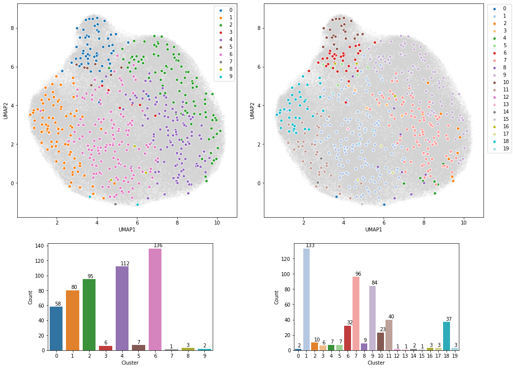
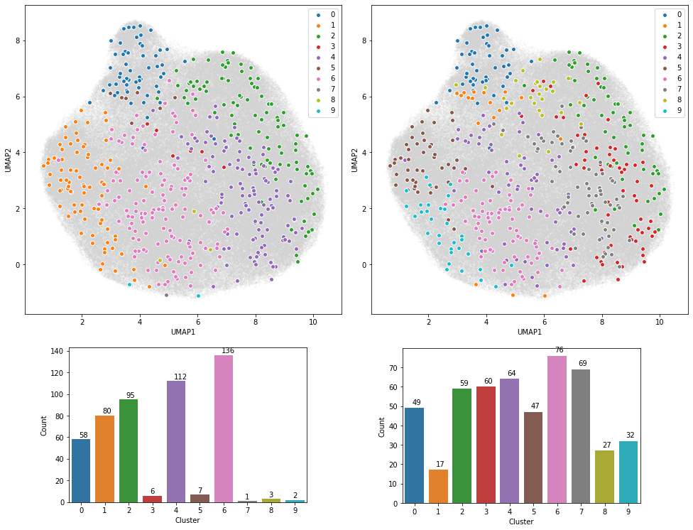
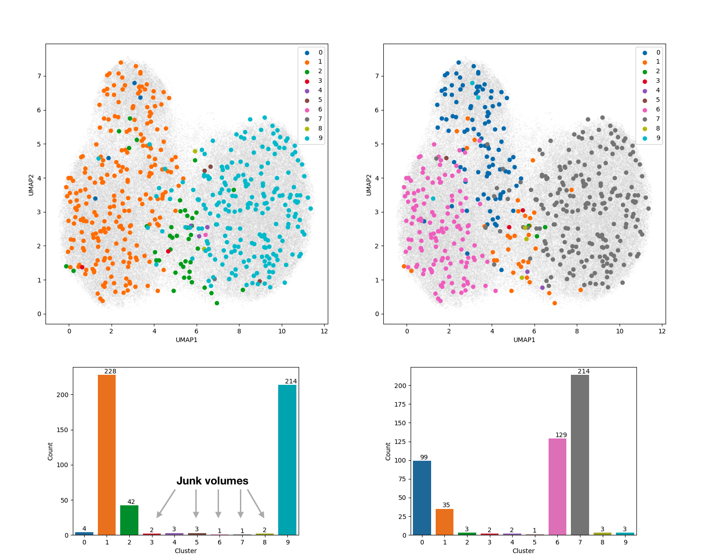
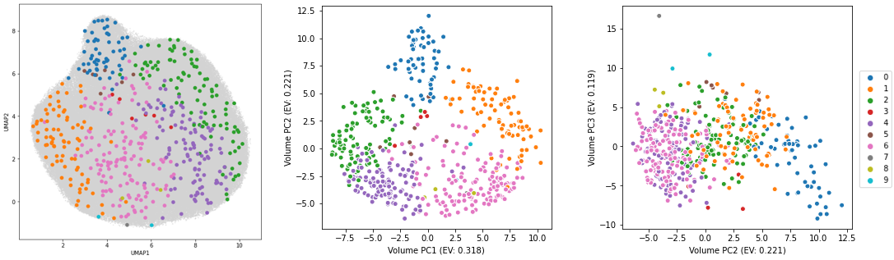
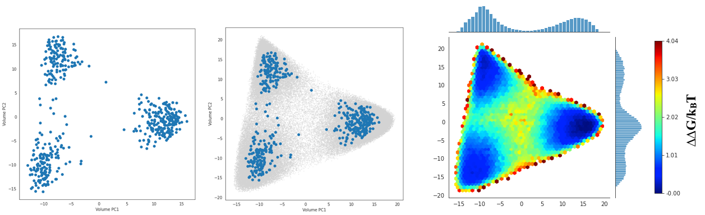

# cryoDRGN Conformational Landscape Analysis

CryoDRGN is a machine learning system for heterogenous cryo-EM reconstruction. In cryoDRGN’s framework of *generative modeling*, once a model is trained, an arbitrary number of volumes may be reconstructed, thus tools are needed to comprehensively explore the reconstructed distribution. This page describes a new “landscape analysis” tool for comprehensive and quantitative analysis of a trained cryodrgn model, including **1) assigning discrete conformational states (and providing their particle lists for refinement)** and **2) visualizing continuous conformational landscapes**. This tool also allows the user to focus their analysis on specific regions of interest by providing custom masks.

Landscape analysis is implemented in the executables, `cryodrgn analyze_landscape` and `cryodrgn analyze_landscape_full`  available in version 1.0+ of the cryoDRGN [software](https://github.com/zhonge/cryodrgn). The analysis pipeline is fully automated, though there are many command line arguments that can be experimented with, and we provide a jupyter notebook for interactive visualization.

A description of the method is found in [Chapter 6 of Ellen Zhong’s thesis](https://www.cs.princeton.edu/~zhonge/papers/zhong-phd-csb-2022.pdf).


*Overview of the `cryodrgn analyze_landscape` pipeline. We show the general schematic (top) and its application to a dataset of the ClpXP protease from [Fei et al. 2020](https://elifesciences.org/articles/61496) (bottom).*

## 1. Quickstart

Example usage:

```
(cryodrgn) $ cryodrgn analyze_landscape [workdir] [epoch]

# for example:
(cryodrgn) $ cryodrgn analyze_landscape /path/to/cryodrgn/output/directory 24 # assuming 25 epochs of training (0-indexed)

# Use the flag -h to see all settings and their defaults:
(cryodrgn) $ cryodrgn analyze_landscape -h
```

- `(cryodrgn) $ cryodrgn analyze_landscape -h`

    ```
    (cryodrgn) $ cryodrgn analyze_landscape -h
    usage: analyze_landscape.py [-h] [--device DEVICE] [-o OUTDIR] [--skip-vol]
                                [--skip-umap] [--vol-ind VOL_IND]
                                [--linkage LINKAGE] [-M M] [--pc-dim PC_DIM]
                                [--plot-dim PLOT_DIM] [--Apix APIX] [--flip]
                                [-d DOWNSAMPLE] [--ksample KSAMPLE]
                                [--thresh THRESH] [--dilate DILATE]
                                workdir epoch

    Pipeline to analyze cryoDRGN volume distribution

  positional arguments:
    workdir               Directory with cryoDRGN results
    epoch                 Epoch number N to analyze (0-based indexing, corresponding to z.N.pkl, weights.N.pkl)

  optional arguments:
    -h, --help            show this help message and exit
    --device DEVICE       Optionally specify CUDA device
    -o OUTDIR, --outdir OUTDIR
                          Output directory for landscape analysis results (default: [workdir]/landscape.[epoch])
    --skip-umap           Skip running UMAP
    --vol-ind VOL_IND     Index .pkl for filtering volumes

  Extra arguments for volume generation:
    -N SKETCH_SIZE, --sketch-size SKETCH_SIZE
                          Number of volumes to generate for analysis (default: 1000)
    --Apix APIX           Pixel size to add to .mrc header (default: 1 A/pix)
    --flip                Flip handedness of output volume
    -d DOWNSAMPLE, --downsample DOWNSAMPLE
                          Downsample volumes to this box size (pixels) (default: 128)
    --skip-vol            Skip generation of volumes
    --vol-start-index VOL_START_INDEX
                          Default value of start index for volume generation (default: 0)

  Extra arguments for mask generation:
    --thresh THRESH       Density value to threshold for masking (default: half of max density value)
    --dilate DILATE       Dilate initial mask by this amount (default: 5 pixels)
    --mask MRC            Path to a custom mask. Must be same box size as generated volumes.

  Extra arguments for clustering:
    --linkage LINKAGE     Linkage for agglomerative clustering (e.g. average, ward) (default: average)
    -M M                  Number of clusters (default: 10)

  Extra arguments for landscape visualization:
    --pc-dim PC_DIM       PCA dimensionality reduction (default: 20)
    --plot-dim PLOT_DIM   Number of dimensions to plot (default: 5)
    ```


By default, the script will:

1. **Generate 1000 volumes** at a box size of 128^3
2. **Perform PCA**  on the volumes to map conformational coordinates. The goal is for the volume PCA coordinates to provide a more visually interpretable representation of the dataset than the VAE latent space.
3. **Cluster the volumes** and provide summary volumes and the constituent particles for each cluster.

By default, all outputs will be located in a subdirectory `[workdir]/landscape.[epoch]`.

The expected runtime is ~30 min (1 GPU) which is mostly spent on volume generation); Rerunning the tool without volume generation (`--skip-vol`) should take less than 5 min (no GPU)

### Outputs at a glance

- `kmeans1000`: 1000 generated volumes
- `clustering_L2_average_10`: clustering of the sketched volume ensemble as summary conformational states with:
    - The mean and std volume for each cluster
    - The constituent particles for each cluster (.pkl), which can be converted to a .star file
- `pcs`: 5 eigenvolume trajectories of the sketched volume ensemble as summary reaction coordinates

## 2. Assigning 3D conformational states (”classes”)

Once 1000 volumes are generated, they are clustered to summarize the major conformational states of the reconstructed ensemble. This clustering approach mirrors some of the assumptions in 3D classification (i.e. that particles fall in 1 of K discrete classes). The resulting clusters can be interpreted as the main conformational states, and this tool provided the constituent particles as a .star file can be exported to other tools for further refinement.

We use agglomerative clustering, a bottom-up clustering algorithm that does not impose any geometric priors on the shape or size of the clusters. Through testing on several datasets, we find that this is effective at **identifying rare states.** We also use a **mask** around the particle to reduce the effect of noise in the background of the density map. A mask may also be manually provided to focus on a specific region (see Section 3).

There are many hyperparameters of the clustering algorithm. As a best practice, one should experiment with the number of clusters (`-M`) and the agglomerative clustering affinity type (e.g. `--linkage average` or `--linkage ward`).  See the below subsections for some examples of changing these parameters.

### Outputs

The outputs of clustering will be located in a subdirectory `clustering_L2_average_10`

- Each cluster is described by:
    - A mean volume and standard deviation volume, e.g. 0_mean.mrc, 0_std.mrc, 1_mean.mrc, 1_std.mrc, ...
    - A numbered subdirectory (`0`, `1`, `2`, etc.) containing the volumes in each cluster
    - A list of the underlying particles (as an index `.pkl` file) that may be converted to a .star file with `cryodrgn_utils write_star`
- Visualization of the 1000 volumes colored by cluster label in the VAE latent space (umap.png, umap_annotated.png) and in the volume PCA space (vol_embeddings_1000*png).
- Volume and particle counts for each cluster (volume_counts.png, particle_counts.png)

```bash
(cryodrgn) $ ls clustering_L2_average_10/
0                   2_std.mrc           5_particle_ind.pkl  8_mean.mrc           vol_embeddings_1000_annotated_1_2.png
0_mean.mrc          3                   5_std.mrc           8_particle_ind.pkl   vol_embeddings_1000_annotated_2_3.png
0_particle_ind.pkl  3_mean.mrc          6                   8_std.mrc            vol_embeddings_1000_annotated_3_4.png
0_std.mrc           3_particle_ind.pkl  6_mean.mrc          9                    vol_embeddings_1000_annotated_4_5.png
1                   3_std.mrc           6_particle_ind.pkl  9_mean.mrc           vol_embeddings_1000_clusters_1_2.png
1_mean.mrc          4                   6_std.mrc           9_particle_ind.pkl   vol_embeddings_1000_clusters_2_3.png
1_particle_ind.pkl  4_mean.mrc          7                   9_std.mrc            vol_embeddings_1000_clusters_3_4.png
1_std.mrc           4_particle_ind.pkl  7_mean.mrc          state_labels.pkl     vol_embeddings_1000_clusters_4_5.png
2                   4_std.mrc           7_particle_ind.pkl  particle_counts.png  volume_counts.png
2_mean.mrc          5                   7_std.mrc           umap_annotated.png
2_particle_ind.pkl  5_mean.mrc          8                   umap.png
```

### Optional: Change the number of clusters with -M:

The default number of clusters is 10. If your dataset is very heterogeneous or if you want a finer resolution, you can increase the number of clusters with the `-M` flag. Changing `M` corresponds to changing the cut point in the dendrogram of agglomerative clustering. Clustering can be repeated by re-running `cryodrgn analyze_landscape` and using the `--skip-vol` flag to skip volume generation, for example:

```
(cryodgn) $ cryodrgn analyze_landscape [workdir] [epoch] --skip-vol -M 20 # use --skip-vol to skip regenerating 1000 volumes

# Results will be found in a new subdirectory, clustering_L2_average_[M]
```



*Left: Clustering results with M=10; Right: Clustering results with M=20*

The updated clustering results will be a new subdirectory, `clustering_L2_average_[M]`.

### Optional: Change agglomerative clustering linkage with —linkage:

The linkage type affects how volumes are merged in the agglomerative clustering algorithm. The default setting is `--linkage average`, which, we have found to be sensitive to outliers (e.g. junk/artifacts or rare states of interest). For more evenly populated clusters (e.g. discretizing a structural continuum), try `--linkage ward`.

```
(cryodgn) $ cryodrgn analyze_landscape [workdir] [epoch] --skip-vol --linkage ward # use --skip-vol to skip regenerating 1000 volumes
```



Left: Clustering results with average linkage (M=10); Right: Clustering results with ward linkage (M=10)

Rerunning landscape analysis with `--linkage ward` will produce a new subdirectory, `clustering_L2_ward_10`.

### Optional: Remove junk clusters/volumes

Some datasets will contain "junk" volumes that can interfere with clustering/PCA analysis. These volumes can be selected and removed with the utility `cryodrgn_utils select_clusters`:



*Left: Clustering results with default settings. Manual inspection of the cluster means revealed broken/junk volumes for clusters 3,5,6,7,8. Right: Repeating cryodrgn analyze_landscape after removing the 9 junk volumes from the analysis.*

```
# e.g. keep the volumes from clusters 0, 1, 2, 4, 9
(cryodrgn) $ cryodrgn_utils select_clusters clustering_L2_average_10/state_labels.pkl --sel 0 1 2 4 9 -o vol_keep.pkl

# rerun cryodrgn analyze_landscape with --vol-ind
(cryodrgn) $ cryodrgn analyze_landscape [workdir] [epoch] --skip-vol --vol-ind vol_keep.pkl
```

Note: rerunning with `—-vol-ind` will change the volume PCA results since volumes have now been removed from the analysis.

## 3. Masking (optional)

This tool applies a mask on all 1000 volumes before PCA/clustering analysis. The default mask is generated by thresholding all 1000 generated volumes at half of their max density values and then combining all masks (by their union). The masking settings may be adjusted with the `--thresh` and `--dilate` arguments if this automated mask generation leaves in undesired regions (e.g. extra background) or leaves out heterogeneous regions of the particle. To check the mask, see the `mask.mrc` and `mask_slices.png` file in the output directory.


*A user-defined mask around the heterogeneous region of the complex*

Alternatively, a custom mask can be provided with the flag `--mask`. Note, the mask will be converted to a *binary mask*, where any nonzero voxel will be included in the analysis:

```
# rerun cryodrgn analyze_landscape with custom mask
(cryodrgn) $ cryodrgn analyze_lanscape [workdir] [epoch] --skip-vol --mask /path/to/your/mask/eg/job008.mrc
```

## 4. Visualizing conformational landscapes

Taking inspiration from [previous work](https://www.sciencedirect.com/science/article/pii/S0092867418300473), we apply principal component analysis (PCA) on the set of cryoDRGN volumes to map reaction coordinates and visualize a conformational landscape that is more interpretable than the cryoDRGN latent variable representation.

---

### Output

The output of `cryodrgn analyze_landscape` will include a directory containing the top 5 principal components (.mrc trajectories showing interpolations along the "eigenvolumes"). These principal component trajectories can be interpreted as reaction coordinates for describing the full ensemble, which can provide a more interpretable visualization of the dataset than the latent variable representation.



*Left: Visualization of the dataset in the cryoDRGN VAE latent space, colored points correspond to 1000 sampled volumes colored by their cluster label. Center/right: Visualization of 1000 sampled volumes in their PCA feature space. In this example, PC1, PC2, and PC3 correspond to biologically relevant motions and thus the overall organization of the ensemble is more easily interpretable.*

## 5. Visualizing the full conformational landscape

The initial mapping of the volumes is performed on the set of 1000 sketched volumes. A second tool, `cryodrgn analyze_landscape_full`, maps all particles to the volume PCA space to visualize a conformational landscape for the full dataset.  This tool will take longer to run (~4 hours on 1 GPU for volume generation, 1 min for mapping).

```bash
(cryodrgn) $ cryodrgn analyze_landscape_full [workdir] [epoch] > landscape_full.log
```



Left: Visualization of the 1000 volumes in the volume PCA feature space where each volume is a point. Center: Mapping the entire dataset of ~10^5 volumes to the PCA feature space (grey points). Right: Visualizing the conformational landscape as a heatmap on a logscale (i.e. a free energy landscape)

This command produces a jupyter notebook, `cryoDRGN_landscape_viz.ipynb`, for plotting the inferred conformational landscape.
