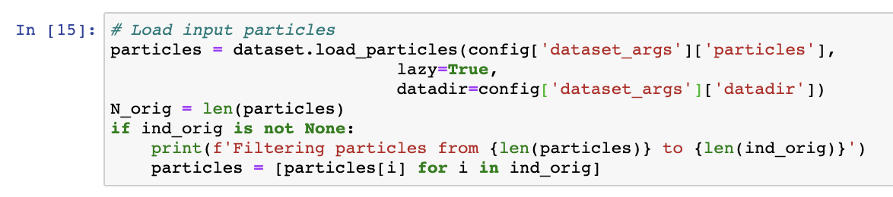
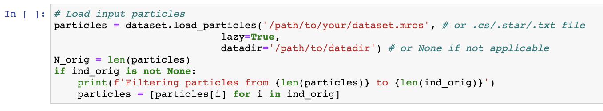

# cryoDRGN preprocess for large datasets

CryoDRGN by default loads the entire dataset into memory for fast data access during training. However, large cryo-EM datasets can easily exceed the amount of memory available on standard workstations. For these datasets that do not fit into memory, `cryodrgn train_vae` can be run with the additional `--lazy` flag, which loads images on-the-fly instead of all at once at the beginning of training. This can, however, be very slow due to the filesystem access pattern for on-the-fly image loading, especially if the data is not located on a SSD drive.

To reduce the memory requirement of loading the whole dataset, as of version 0.3.3, cryoDRGN contains a tool `cryodrgn preprocess` that performs some of the image preprocessing done at the beginning of training. Separating out image preprocessing significantly reduces the memory requirement of `cryodrgn train_vae`, potentially leading to major training speedups ⚡ ⚡ ⚡ .

The new workflow replaces `cryodrgn downsample` with `cryodrgn preprocess` in the standard cryoDRGN workflow. Note that a new preprocessed particle stack will be created:

```bash
# Replace `cryodrgn downsample` with `cryodrgn preprocess`
cryodrgn preprocess P10_J712_particles_exported.cs \
		--datadir P10/exports/groups/P10_J628_particles/J626/extract \
		-D 128 \
		-o data/preprocessed/128/particles.mrcs

# Parse pose information as usual, specifying the refinement box size with -D
cryodrgn parse_pose_csparc P10_J712_particles_exported.cs \
		-D 256 \
		-o data/pose.pkl

# Parse CTF information as usual
cryodrgn parse_ctf_csparc P10_J712_particles_exported.cs -o data/ctf.pkl

# Run cryoDRGN with preprocessed particles.ft.txt and extra flag --preprocessed
cryodrgn train_vae data/preprocessed/128/particles.ft.txt \
		--preprocessed \
		--ctf data/ctf.pkl \
		--poses data/pose.pkl \
		--zdim 8 \
		-n 50 \
		-o 00_vae128 >> 00.log
```

## Numbers

Some numbers for training on a 1,375,854, 128x128 particle dataset (86 GB)

Baseline:

- 607 GB maximum memory requirement
- 18.5 min to load the dataset in `cryodrgn train_vae`

With new `--preprocessed`:

- 200 GB maximum memory requirement
- 3.2 min to load the dataset in `cryodrgn train_vae`

On a single Nvidia V100 GPU, this dataset trained in approximately 2h,3min per epoch (large 1024x3 model) when fully loaded into memory. Training with on-the-fly data loading (`--lazy`) was 4x slower, though this can vary widely depending on your filesystem/network. Recent tests on cached filesystems do not have a large penalty for `--lazy` image loading.

## Technicalities

- Using `cryodrgn preprocess` in place of `cryodrgn downsample` means that images will be windowed (circular mask applied in real space) *before* they are downsampled. This is slightly different than in the original workflow where images are first downsampled, then the mask is applied during training. To exactly replicate the previous behavior, run `cryodrgn downsample` as usual, then run `cryodrgn preprocess` on the downsampled dataset.
- Viewing particle images in cryoDRGN_viz.ipynb and cryoDRGN_filtering.ipynb will now show Fourier space images. A current workaround is to overwrite the path with the original particles when loading particle images in the jupyter notebook:
    - Before

        

    - After (modifications to dataset.load_particles arguments)

        


## Still too large

If your dataset is still too large to load into memory, we recommend training on a subset of the images such that the dataset can fit into memory (e.g. split your dataset into two halves and run independent training jobs on each half). A random selection of a subset of your dataset can be generated with the utility `cryodrgn_utils select_random`:

```
# select 200k random particles out of a dataset containing 1,375,854 particles
(cryodrgn) $ cryodrgn_utils select_random 1375854 -n 200000 -o ind200k.pkl
```

We are currently implementing a large refactor of lazy data loading. Additional updates and information on chunked data loading are tracked here [https://github.com/zhonge/cryodrgn/issues/17](https://github.com/zhonge/cryodrgn/issues/17). Beta code is available in the `vb/imagesource` pull request [https://github.com/zhonge/cryodrgn/pull/221](https://github.com/zhonge/cryodrgn/pull/221).
